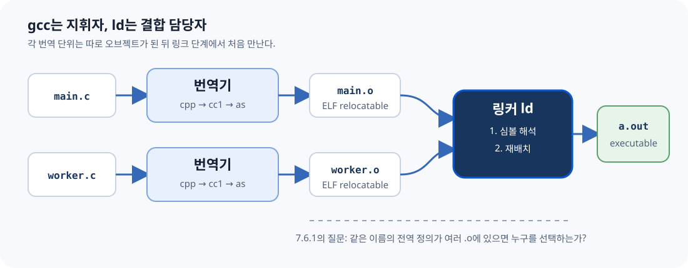
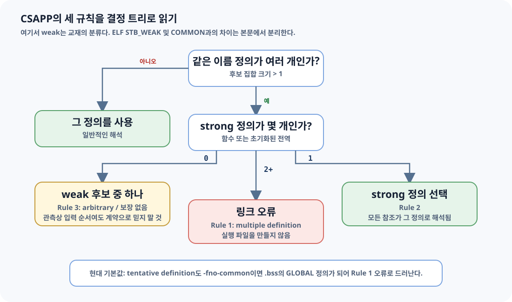
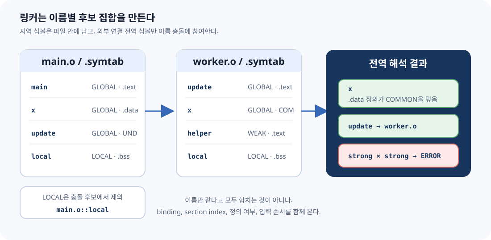
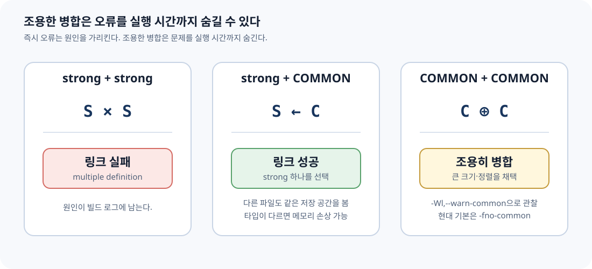
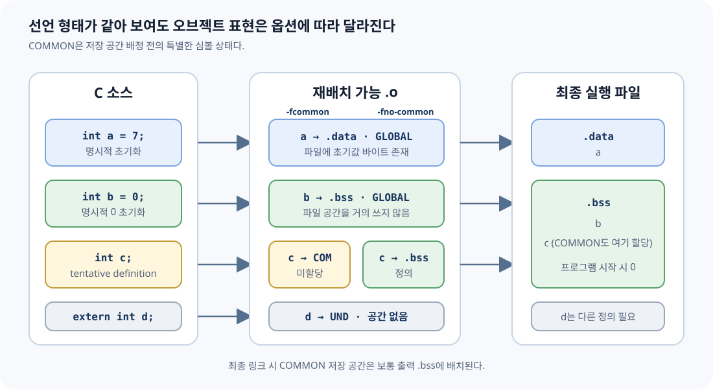
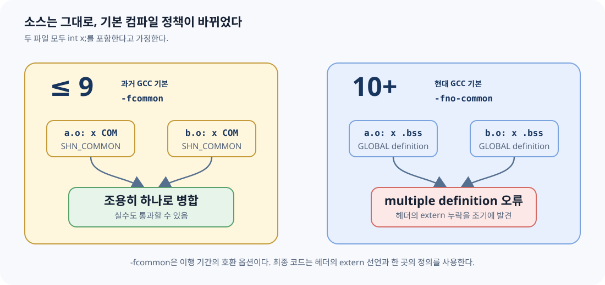

# CSAPP 7.6.1 — 같은 이름의 심볼을 링커는 어떻게 고르는가

> **How Linkers Resolve Duplicate Symbol Names**

> 2026-07-26 CSAPP Study · Linking

strong/weak 세 규칙에서 시작해 C의 tentative definition, ELF의 `SHN_COMMON`,
GCC 10의 `-fno-common` 변경까지 실제 오브젝트 파일로 연결한다.

- 기준 절: CSAPP 3e §7.6.1
- 검증 도구: GCC 13.3, Clang 18.1, GNU ld 2.42, lld 18.1
- 검증 환경: Ubuntu 24.04 aarch64
- HTML 버전: [chapter-7.6.1.html](chapter-7.6.1.html)
- 참고문헌: [references.md](references.md)
- 전체 검증 로그: [verified-linux-aarch64.txt](results/verified-linux-aarch64.txt)

## 목차

1. [무엇이 책이고, 무엇이 현대 보충인가](#reading)
2. [ELI5: 이름표가 겹친 물품 창고](#eli5)
3. [링커 문맥 복원](#context)
4. [CSAPP의 strong / weak 세 규칙](#rules)
5. [교재의 weak와 ELF의 WEAK](#elf-truth)
6. [CSAPP 7.6.1의 다섯 사례](#book-cases)
7. [tentative definition, COMMON, .bss, .data](#storage)
8. [GCC 10의 -fno-common 전환](#gcc10)
9. [nm, readelf, objdump 실험](#lab)
10. [GNU ld와 lld](#linkers)
11. [QUIZ · EXERCISE · 면접 질문](#practice)
12. [용어 사전](#glossary)
13. [책의 절·예제·그림 대응표](#mapping)
14. [Beyond CSAPP](#beyond)

<a id="reading"></a>

## 무엇이 책이고, 무엇이 현대 보충인가

- **[CSAPP]**: 3판 7.6.1의 논점, 세 규칙, 다섯 코드 사례, Practice Problem 7.2를 재서술한다.
- **[OFFICIAL]**: C11 초안, System V ELF ABI, GCC·Clang·GNU ld·lld 공식 문서와 정오표를 뜻한다.
- **[COMMENTARY]**: 교재와 현대 도구 사이의 차이, 실험 해석, 실무 안전 규칙을 명시적으로 덧붙인다.

> **NOTE · 절 제목 확인**
>
> CSAPP 3판의 정확한 제목은 **How Linkers Resolve Duplicate Symbol Names**다. 2판의 제목은 **How Linkers Resolve Multiply Defined Global Symbols**이었다. 이 노트는 3판을 기준으로 한다.

> **WARNING · 2015년 책의 기본값과 2026년 도구는 다르다**
>
> 책의 weak 전역 예제는 과거 GCC의 `-fcommon` 기본 동작을 전제로 한다. GCC 10부터 기본값은 `-fno-common`이다. 따라서 책의 “조용히 합쳐진다”는 예제를 현재 GCC에서 그대로 실행하면 기본 설정에서는 링크 오류가 난다.

전체 근거와 조사 한계는 [references.md](references.md), 전체 검증 로그는 [verified-linux-aarch64.txt](results/verified-linux-aarch64.txt)에 있다.

<a id="eli5"></a>

## ELI5: 이름표가 겹친 물품 창고

> **ELI5**
>
> 여러 반이 물품을 창고에 맡긴다고 하자. 상자마다 `x`라는 이름표가 붙어 있다. “이게 최종 물건”이라고 확정한 상자 두 개가 오면 창고지기는 어느 것을 써야 할지 몰라 작업을 중단한다. 하나만 확정 상자이고 나머지가 “자리만 필요해요” 상자라면 확정 상자를 쓴다. “자리만 필요해요” 상자만 여러 개라면 하나의 자리로 합친다.

### 확정 상자 둘

`strong + strong`

링크 오류

### 확정 + 임시

`strong + weak/common`

strong 선택

### 임시 상자들

`weak/common + weak/common`

하나로 병합 또는 하나 선택

> **GOTCHA**
>
> 비유의 “임시 상자”는 한 종류가 아니다. 교재의 weak 분류, ELF의 `STB_WEAK`, ELF의 `SHN_COMMON`은 서로 겹치지만 같은 말은 아니다. 뒤에서 심볼 표의 실제 열로 분리한다.

<a id="context"></a>

## REMIND: 7.6.1에 도착하기 전 알아야 할 것

> **REMIND · 7.1–7.5 압축 복원**
>
> 각 **번역 단위(translation unit)**는 따로 컴파일된다. 컴파일러는 다른 `.c` 파일의 내부를 보지 못한 채 재배치 가능 오브젝트 **(relocatable object file)**를 만든다. 여러 파일의 전역 이름이 처음 만나는 시점은 링크 단계다.



**FIGURE N1** 컴파일러 드라이버와 링커. 이 문서에서 새로 제작한 설명용 SVG.

### 링커가 하는 두 가지 일

#### 1. 심볼 해석 (symbol resolution)

각 심볼 참조를 정확히 하나의 정의에 연결한다. 7.6.1의 주제다.

#### 2. 재배치 (relocation)

합쳐진 코드와 데이터의 최종 주소를 정하고 참조 위치를 고친다. 7.7의 주제다.

### 세 종류의 링커 심볼

**global definition**

모듈이 정의하고 다른 모듈에서도 참조할 수 있는 비정적 함수와 전역 변수.

**local definition**

`static`으로 내부 연결을 갖는 함수·파일 범위 변수. 같은 이름이 다른 오브젝트에 있어도 충돌하지 않는다.

**external reference**

현재 모듈이 참조하지만 정의하지 않은 심볼. ELF에서는 보통 `SHN_UNDEF`.

> **COMMON MISTAKE · local symbol ≠ local variable**
>
> 여기서 local symbol은 오브젝트 파일 밖에서 보이지 않는 심볼이다. 함수 안 자동 지역 변수는 보통 런타임 스택이나 레지스터에 놓이며 링커의 전역 이름 해석 대상이 아니다.

<a id="rules"></a>

## CSAPP의 strong / weak 세 규칙

**[CSAPP]** 교재는 Linux 컴파일 시스템의 중복 이름 처리를 다음 모델로 설명한다. 함수와 초기화된 전역 변수는 strong, 초기화되지 않은 전역 변수는 weak로 분류한다.

- **strong가 둘 이상이면 오류** — 같은 이름의 강한 정의는 하나만 존재해야 한다. 함수 중복 정의도 여기에 포함된다.
- **strong 하나를 선택** — strong 하나와 weak 여러 개가 있으면 strong 정의가 모든 참조를 만족한다.
- **weak 중 하나를 선택** — weak만 여러 개면 어느 하나를 고른다. 어떤 것을 고를지 프로그램이 가정하면 안 된다.



**FIGURE N2** 교재의 세 규칙을 결정 트리로 재구성.

> **WARNING · arbitrary는 random이 아니다**
>
> “아무 weak나 고른다”는 매 실행마다 무작위라는 뜻이 아니다. 특정 링커 버전과 입력 순서에서는 결과가 반복될 수 있다. 뜻은 **소스 언어 수준에서 이식 가능한 선택을 보장하지 않는다**는 것이다.

<a id="elf-truth"></a>

## 가장 중요한 구분: 교재의 weak와 ELF의 WEAK

**[OFFICIAL · ELF ABI]** ELF 심볼 표의 `Bind`에는 `LOCAL`, `GLOBAL`, `WEAK`가 있다. `SHN_COMMON`은 binding이 아니라 **특별한 section index**다.

> **GOTCHA · 책의 weak 분류를 readelf의 WEAK로 번역하지 말 것**
>
> GCC `-fcommon`에서 파일 범위 `int x;`를 컴파일하면 실제 출력은 대개 `OBJECT GLOBAL DEFAULT COM x`다. 즉 `Bind=GLOBAL`, `Ndx=COM`이며 `Bind=WEAK`가 아니다.

| C 표기 | 교재 모델 | 현대 GCC ELF 관측 | `nm` | 중복 시 |
| --- | --- | --- | --- | --- |
| `int f(void) {…}` | strong | `FUNC GLOBAL .text` | `T` | 두 정의면 오류 |
| `int x = 7;` | strong | `OBJECT GLOBAL .data` | `D` | 두 정의면 오류 |
| `int x = 0;` | strong | `OBJECT GLOBAL .bss` | `B` | 두 정의면 오류 |
| `int x;` + `-fcommon` | weak | `OBJECT GLOBAL COM` | `C` | COMMON 병합 가능 |
| `int x;` + `-fno-common` | 책 이후 기본값 | `OBJECT GLOBAL .bss` | `B` | 여러 번역 단위면 오류 |
| `__attribute__((weak))` | 명시적 weak | `OBJECT WEAK .data` | `V` | GLOBAL 정의가 우선 |



**FIGURE N3** 심볼 표 병합의 개념도. LOCAL은 오브젝트별 이름 공간에 남는다.

### 실제 출력으로 확인

**GCC 13.3 · -fcommon · OBSERVED**

```text
$ readelf -Ws sc-worker.o | grep ' x$'
16: 0000000000000004  4 OBJECT  GLOBAL DEFAULT  COM x

$ nm -S sc-worker.o
0000000000000004 0000000000000004 C x
```

**명시적 ELF weak attribute · OBSERVED**

```text
$ readelf -Ws ew-provider.o | grep ' hook$'
17: 0000000000000000  4 OBJECT  WEAK   DEFAULT  3 hook

$ nm -S ew-provider.o
0000000000000000 0000000000000004 V hook
```

<a id="book-cases"></a>

## CSAPP 7.6.1의 다섯 사례

**[CSAPP]** 책의 코드 표현을 장문 복제하지 않고, 각 두 모듈이 무엇을 정의하고 어떤 규칙이 적용되는지 빠짐없이 재구성했다. 실행 가능한 변형은 [examples/](examples/)에 있다.

### 사례 1 · `main` 함수가 두 개

두 모듈 모두 `main` 함수를 정의한다. 함수 정의는 strong이므로 Rule 1에 따라 링크 오류다. “어느 main이 먼저인가”를 따질 단계가 아니다.

**duplicate-function · OBSERVED · GNU ld**

```text
multiple definition of `helper';
df-main.o: first defined here
collect2: error: ld returned 1 exit status
```

### 사례 2 · 초기화된 전역 `x`가 두 개

두 모듈이 모두 `int x = 15213;` 같은 초기화된 전역을 정의한다. 둘 다 strong이므로 함수 중복과 똑같이 링크 오류다. 값이 우연히 같아도 동일한 저장 객체라는 증거가 아니므로 허용되지 않는다.

### 사례 3 · 초기화된 `x` + 초기화되지 않은 `x`

과거 기본값 또는 `-fcommon`에서는 첫 모듈의 초기화된 `x`가 strong, 다른 모듈의 `int x;`가 COMMON 후보가 된다. strong 정의가 선택되고, 다른 모듈의 함수도 그 같은 저장 공간을 쓴다. 책의 결과처럼 `update()`가 호출자 모르게 값을 바꿀 수 있다.

**strong-common · OBSERVED**

```text
$ nm -S sc-main.o sc-worker.o | grep ' x$'
0000000000000000 0000000000000004 D x
0000000000000004 0000000000000004 C x

$ ./strong-common
x = 15212
```

### 사례 4 · 초기화되지 않은 `x`가 두 개

`-fcommon`에서는 두 tentative definition이 COMMON으로 나온다. GNU ld는 하나의 저장 공간으로 병합하며, `--warn-common`을 주면 이 조용한 병합을 경고로 드러낼 수 있다. 현대 기본 `-fno-common`에서는 둘 다 `.bss` 정의이므로 오류다.

**common-common · OBSERVED · -fcommon**

```text
$ gcc -Wl,--warn-common cc-main.o cc-worker.o -o common-common
ld: cc-worker.o and cc-main.o: warning: multiple common of `x'
$ ./common-common
x = 15212
```

### 사례 5 · 이름은 같고 타입은 다르다

한 모듈은 `int x`, 다른 모듈은 `double x`라고 믿는다. 링커의 주된 해석 키는 C 타입이 아니라 심볼 이름과 오브젝트 메타데이터다. `-fcommon`에서 strong `int`가 선택되면, 다른 모듈은 같은 주소에 8바이트 `double`을 쓸 수 있다. 인접 객체가 덮일 수 있는 심각한 버그다.

> **WARNING · 출력 값은 시스템 의존**
>
> 책의 x86-64 예시는 `x`와 바로 다음 `y`가 함께 손상되는 한 배치를 보여 준다. CSAPP 공식 정오표는 정확한 손상 값이 시스템 의존이라고 명시한다. 본 aarch64 실험에서는 `x=0`이 되었지만 `y`는 유지됐다. 어느 쪽도 프로그램이 의존할 수 있는 결과가 아니다.

**common-mismatch · OBSERVED · aarch64**

```text
ld: warning: common of `x' overridden by definition
ld: warning: alignment 4 of normal symbol `x' is smaller than 8
ld: warning: alignment discrepancies can cause real problems

$ ./common-mismatch
x = 0x0 y = 0x3b6c
```



**FIGURE N4** 실패보다 위험할 수 있는 조용한 성공.

<a id="storage"></a>

## tentative definition, COMMON, .bss, .data

**[OFFICIAL · C11 §6.9.2]** 파일 범위 객체 선언에 initializer가 없고 적절한 storage-class 조건을 만족하면 **tentative definition(잠정 정의)**이다. 같은 번역 단위 안에 실제 외부 정의가 끝까지 없다면 0 initializer를 가진 정의처럼 동작한다.

> **NOTE · 언어 의미와 파일 배치는 다른 층**
>
> C 표준은 “프로그램 시작 시 0으로 초기화된 객체”라는 의미를 규정한다. 그것을 오브젝트 파일에서 COMMON으로 낼지 `.bss`로 낼지는 컴파일러와 플랫폼의 구현 선택이다.



**FIGURE N5** 입력 오브젝트와 최종 실행 파일의 저장 위치. COMMON 자체는 입력 섹션이 아니다.

| 표현 | 정의/선언 | `-fcommon` 입력 .o | `-fno-common` 입력 .o | 최종 메모리 |
| --- | --- | --- | --- | --- |
| `int a = 7;` | 외부 정의 | `.data` | `.data` | 쓰기 가능한 초기화 데이터 |
| `int b = 0;` | 외부 정의 | `.bss` | `.bss` | 0으로 초기화 |
| `int c;` | tentative definition | `SHN_COMMON` | `.bss` | 최종적으로 보통 `.bss` |
| `extern int d;` | 선언/참조 | `SHN_UNDEF` | `SHN_UNDEF` | 다른 정의가 제공해야 함 |
| `static int e;` | 내부 연결 tentative | `.bss LOCAL` | `.bss LOCAL` | 모듈 전용 0 초기화 객체 |

> **COMMON MISTAKE · “COMMON section”을 실제 섹션이라고 생각하기**
>
> ELF `SHN_COMMON` 심볼은 아직 어느 입력 섹션에도 할당되지 않았다. `st_value`는 주소가 아니라 정렬 조건이고, `st_size`가 필요한 바이트 수다. GNU ld 스크립트의 `*(COMMON)`은 이런 심볼을 출력 `.bss`에 배치하기 위한 특별 표기다.

<a id="gcc10"></a>

## GCC 10: 실수를 허용하던 기본값을 뒤집다

**[OFFICIAL · GCC 10 PORTING GUIDE]** GCC 10은 C에서도 `-fno-common`을 기본으로 바꿨다. 헤더에 `int x;`를 써 여러 파일에서 정의를 만들어 버리는 실수를 링크 오류로 드러내고, 일부 target에서는 더 효율적인 전역 접근도 가능하게 한다.



**FIGURE N6** GCC 10 전후의 기본 정책. 본 실험은 현재 GCC에서 두 플래그를 명시해 같은 의미를 재현했다.

### 과거 의미 재현

**-fcommon · PASS**

```text
gcc -fcommon -c main.c worker.c
gcc main.o worker.o -o before
./before
x = 15212
```

### 현대 기본 의미 재현

**-fno-common · EXPECTED ERROR**

```text
gcc -fno-common -c main.c worker.c
gcc main.o worker.o -o after
multiple definition of `x'
```

### Clang 18에서도 플래그의 의미는 같다

**Clang 18.1.3 + lld 18.1.3 · OBSERVED**

```text
$ clang -c main.c worker.c
# 기본 출력: x는 각 .o의 .bss GLOBAL 정의 → duplicate symbol 오류

$ clang -fcommon -c main.c worker.c
# x는 GLOBAL COM → 링크 성공, x = 15212

$ clang -fno-common -c main.c worker.c
# x는 각 .o의 .bss GLOBAL 정의 → duplicate symbol 오류
```

### 고치는 방법

**전역 변수의 단일 정의 패턴 · RECOMMENDED**

```c
/* state.h: 공간을 만들지 않는 선언 */
extern int x;

/* state.c: 프로그램 전체에서 정확히 하나인 정의 */
int x = 0;

/* user.c: 헤더를 통해 같은 객체를 참조 */
#include "state.h"
```

> **COMMON MISTAKE · 링크가 되게 하려고 -fcommon만 되돌리기**
>
> 레거시 이행을 위해 임시로 쓸 수는 있지만, 중복 정의 설계를 그대로 숨긴다. 먼저 헤더의 정의를 `extern` 선언으로 바꾸고 한 구현 파일에만 정의를 둔다.

<a id="lab"></a>

## 실험실: nm, readelf, objdump로 증거 읽기

아래 출력은 [verify-elf.sh](verify-elf.sh)를 Ubuntu 24.04 aarch64 컨테이너에서 실행한 결과다. macOS의 `gcc`는 Apple Clang이며 Mach-O를 만들기 때문에, ELF 설명과 섞지 않았다.

### `nm` 한 글자 해독표

#### `D` / `d`

초기화된 data. 대문자는 보통 global, 소문자는 local.

#### `B` / `b`

BSS의 0 초기화·미초기화 데이터.

#### `C`

아직 할당되지 않은 common symbol.

#### `T` / `t`

text 영역의 함수·코드.

#### `U`

현재 오브젝트에는 정의가 없는 참조.

#### `V` / `W`

실제 weak object / weak non-object.

### 같은 소스, 다른 section index

**storage-layout/symbols.c · OBSERVED**

```text
$ nm -S layout-common.o
0000000000000000 0000000000000004 D initialized
0000000000000004 0000000000000004 C tentative
0000000000000000 0000000000000004 B zero

$ nm -S layout-nocommon.o
0000000000000000 0000000000000004 D initialized
0000000000000000 0000000000000004 B tentative
0000000000000004 0000000000000004 B zero
```

### `static`은 이름을 파일 안에 가둔다

**static-internal · OBSERVED**

```text
$ ./static-internal
main.x=11 other.x=22
$ nm -a static-internal | grep ' [bd] x$'
0000000000020010 d x
0000000000020014 d x
```

소문자 `d`는 두 `x`가 각각 local data symbol임을 보인다. 소스 이름은 같지만 외부 연결 이름 공간에 나오지 않으므로 충돌하지 않는다.

### 직접 재현

**macOS에서도 ELF를 똑같이 재현 · DOCKER**

```text
cd chapter07
./verify-in-docker.sh

# HTML과 Markdown의 로컬 링크·필수 블록도 검사
node verify-html.mjs
```

> **NOTE · .o를 커밋하지 않는 이유**
>
> 실습 노트는 오브젝트 내용을 직접 참조하지만, 이 산출물은 CPU·OS·컴파일러에 의존한다. 재생성 명령과 검증 텍스트는 추적하고, `examples/build/`의 바이너리는 추적하지 않는다.

<a id="linkers"></a>

## GNU ld와 lld: 규칙은 같고 진단은 다르다

### GNU ld 2.42

**strong + strong · ERROR**

```text
multiple definition of `conflict';
ss-main.o: first defined here
```

### lld 18.1.3

**strong + strong · ERROR**

```text
duplicate symbol: conflict
>>> defined at main.c:3
>>> defined at other.c:1
```

둘 다 기본적으로 중복 strong 정의를 거부한다. lld는 각 정의의 소스 위치를 구조적으로 보여 줬고, GNU ld는 “first defined here” 형태로 보여 줬다.

### 실제 WEAK + WEAK 입력 순서 실험

**GNU ld와 lld에서 같은 관측 · OBSERVED, NOT GUARANTEED**

```text
$ cc main.o left.o right.o -o left-first && ./left-first
choice=11
$ cc main.o right.o left.o -o right-first && ./right-first
choice=22

$ clang -fuse-ld=lld main.o left.o right.o -o lld-left && ./lld-left
choice=11
$ clang -fuse-ld=lld main.o right.o left.o -o lld-right && ./lld-right
choice=22
```

> **WARNING · 관측을 계약으로 승격하지 말 것**
>
> 이 버전의 두 링커는 먼저 입력된 weak 정의를 골랐다. 그러나 ELF ABI는 weak 동작의 일부를 implementation-defined로 두고, 교재도 “어느 weak든”이라고 표현한다. 입력 순서로 기능 선택을 설계하지 말고, 명시적 strong 정의나 등록 메커니즘을 사용한다.

### escape hatch: `--allow-multiple-definition`

GNU ld와 lld 공식 문서는 이 옵션을 주면 여러 정의를 오류로 처리하지 않고 첫 정의를 쓴다고 설명한다. 바이너리 분석·특수 빌드에는 쓸 수 있지만, 일반 애플리케이션의 중복 정의 버그를 고치는 수단은 아니다.

<a id="practice"></a>

## QUIZ · EXERCISE · 면접 질문

### QUIZ

#### Q1. `int x = 0;`은 초기값이 0이므로 weak인가?

<details>
<summary>정답 보기</summary>

아니다. 교재 모델에서 initializer가 있으므로 strong이다. ELF에서는 보통 `GLOBAL`
객체로 `.bss`에 놓인다.

</details>

#### Q2. `readelf`의 `GLOBAL DEFAULT COM`은 ELF weak symbol인가?

<details>
<summary>정답 보기</summary>

아니다. binding은 `GLOBAL`이고 section index가 `SHN_COMMON`이다. 실제 weak binding은
`WEAK`로 표시된다.

</details>

#### Q3. 두 파일에 `static int x;`가 있으면 왜 링크 오류가 아닌가?

<details>
<summary>정답 보기</summary>

`static` 파일 범위 객체는 내부 연결을 가진다. 각 오브젝트의 local symbol이라 서로 다른
이름 공간에 있다.

</details>

#### Q4. GCC 10 이후 여러 파일의 `int x;`가 기본 설정에서 실패하는 이유는?

<details>
<summary>정답 보기</summary>

기본 `-fno-common`이 각 tentative definition을 오브젝트의 `.bss` GLOBAL 정의로 내므로,
링커가 여러 strong 정의로 보고 거부한다.

</details>

### Practice Problem 7.2 대응

<details>
<summary>A. 함수 `main` + tentative object `main`</summary>

함수 정의가 strong, tentative object가 weak/common인 과거 모델에서는 두 참조 모두 함수 정의 쪽에 연결된다. 그러나 함수와 객체가 같은 이름을 공유하는 설계 자체가 타입 안전하지 않다.

</details>

<details>
<summary>B. 함수 `main` + 초기화된 object `main`</summary>

둘 다 strong이므로 Rule 1 링크 오류다.

</details>

<details>
<summary>C. tentative `int x` + initialized `double x`</summary>

과거 모델에서는 initialized `double` strong 정의가 선택되어 두 참조가 그 정의로
해석된다. C 타입 관점에서는 위험한 불일치다. 현대 `-fno-common` 기본에서는 두 정의로
오류가 난다.

</details>

### EXERCISE

1. `examples/storage-layout/symbols.c`에 `static int s;`와 `int z = 0;`을 추가하고 `readelf -Ws`의 Bind/Ndx를 예측한 뒤 확인한다.
2. `common-common`의 두 `x`를 각각 `char x[4]`, `char x[32]`로 바꾸고 `-fcommon -Wl,--warn-common`에서 GNU ld가 어떤 크기를 택하는지 확인한다.
3. `explicit-weak`의 strong 정의를 제거하고 weak 정의만 남긴 뒤 `nm`과 실행 결과를 비교한다.
4. 헤더에 `int counter;`를 둔 잘못된 3파일 프로그램을 만들고, `extern` + 단일 정의 패턴으로 고친다.

### 면접에서 자주 이어지는 질문

#### 컴파일 오류와 링크 오류를 구분해 보라

각 번역 단위의 문법·타입 검사는 컴파일러, 번역 단위 사이 정의 연결은 링커가 담당한다.

#### `.bss`가 파일 크기를 아끼는 이유는?

0 바이트를 모두 저장하지 않고 메모리 크기만 기록해 로더가 0으로 준비할 수 있다.

#### weak symbol은 언제 쓰나?

시스템 코드의 기본 hook, 선택적 override 등에 쓰인다. ELF ABI도 애플리케이션의 무분별한 weak 사용을 경고한다.

#### 왜 헤더에는 `extern`인가?

헤더는 여러 번역 단위에 복제되므로 공간을 만드는 정의가 아니라 하나의 정의를 가리키는 선언이어야 한다.

<a id="glossary"></a>

## 용어 사전: 영문을 기준으로 고정하기

**symbol resolution**

심볼 해석. 각 심볼 참조를 하나의 정의에 연결하는 링크 단계.

**duplicate symbol name**

중복 심볼 이름. 여러 입력 모듈이 같은 외부 이름을 정의한 상태.

**strong symbol**

강한 심볼. CSAPP 모델에서 함수와 초기화된 전역. 같은 이름의 strong은 하나만 허용.

**weak symbol**

약한 심볼. 문맥을 밝혀야 한다. CSAPP 학습 모델인지 ELF `STB_WEAK`인지 구분한다.

**tentative definition**

잠정 정의. 파일 범위에서 initializer 없이 나온 객체 선언의 C 표준 개념.

**common symbol**

공통 심볼. ELF relocatable object에서 아직 저장 공간이 배정되지 않은 `SHN_COMMON` 심볼.

**binding**

바인딩. ELF의 `STB_LOCAL`, `STB_GLOBAL`, `STB_WEAK` 같은 가시성·우선순위 속성.

**linkage**

연결. C 식별자가 다른 범위·번역 단위의 같은 이름 선언과 같은 대상을 가리키는지 정하는 언어 개념.

**translation unit**

번역 단위. 전처리가 끝난 하나의 소스 단위. 각 단위가 독립적으로 컴파일된다.

**relocatable object file**

재배치 가능 오브젝트 파일. 심볼·재배치 정보를 가진 링커 입력 `.o`.

**multiple definition**

다중 정의. 하나여야 하는 외부 strong 정의가 둘 이상인 링크 오류.

**internal linkage**

내부 연결. 파일 범위 `static`처럼 현재 번역 단위 안에서만 같은 대상을 가리킴.

<a id="mapping"></a>

## 책의 절·예제·그림 대응표

| CSAPP 3e 7.6.1 요소 | 책의 역할 | 이 문서 | 재현 실습 |
| --- | --- | --- | --- |
| 절 도입 | 여러 모듈의 같은 전역 이름 문제 제기 | §2–§4 | 전체 |
| Strong/weak Rule 1–3 | Linux 링커 선택 규칙 | §3 결정 트리 | `strong-strong`, `common-common`, `weak-weak` |
| `foo1/bar1` | 중복 `main` 함수 | §5 사례 1 | `duplicate-function` |
| `foo2/bar2` | 초기화된 `x` 중복 | §5 사례 2 | `strong-strong` |
| `foo3/bar3` | strong + uninitialized global | §5 사례 3 | `strong-common` |
| `foo4/bar4` | uninitialized global 둘 | §5 사례 4 | `common-common` |
| `foo5/bar5` | `int`/`double` 타입 불일치와 손상 | §5 사례 5 | `common-mismatch` |
| COMMON과 `.bss` 설명 | 컴파일러가 결정을 링커에 미루는 이유 | §6 | `storage-layout` |
| Practice Problem 7.2 | REF → DEF 규칙 연습 | §10 | QUIZ |
| 번호 Figure | **7.6.1에는 번호가 붙은 교재 Figure가 없다.** 본문 FIGURE N1–N6은 모두 새 설명용 SVG다. |  |  |

> **NOTE · 누락 점검**
>
> 절의 세 규칙, 다섯 코드 사례, 타입 불일치 경고, `-fno-common` 조언, COMMON/`.bss` 결론, Practice Problem 7.2를 모두 대응했다. 7.6 직전의 C++/Java name mangling aside는 7.6.1 본문 밖이므로 용어 확장 범위에 포함하지 않았다.

<a id="beyond"></a>

## Beyond CSAPP: 2026년에 가져갈 규칙

### 빌드 성공을 안전성으로 착각하지 않는다

`-fcommon`의 조용한 병합은 과거 호환 동작이지 타입 검사가 아니다. 링크 성공 뒤에도 ABI 불일치가 남을 수 있다.

### 경고를 링크 계약의 일부로 본다

레거시 코드 조사에는 `-Wl,--warn-common`이 숨은 병합을 드러낸다. CI에서는 관련 경고를 무시하지 않는다.

### weak는 시스템 메커니즘으로 제한한다

기본 구현이나 선택적 hook에는 유용하지만, 애플리케이션 로직을 입력 순서에 의존시키지 않는다.

### 도구 출력에서 층을 읽는다

C의 linkage, ELF의 binding, section index, linker의 선택 규칙을 한 단어 “weak”로 뭉개지 않는다.

### 5분 디버깅 순서

1. 오류의 심볼 이름과 각 정의 파일을 확인한다.
2. `nm -A`로 모든 후보의 글자(`D/B/C/V/W/T`)를 본다.
3. `readelf -Ws`로 `Bind`와 `Ndx`를 분리해 본다.
4. 헤더에 공간을 만드는 정의가 들어갔는지 찾는다.
5. `extern` 선언 + 단일 정의로 고친 뒤 `-fno-common`에서 다시 링크한다.

> **한 문장 결론**
>
> **같은 전역 이름이 여러 파일에 보이면, 링커의 관용에 기대지 말고 정의의 소유자를 하나로 만든다.**

---

CSAPP 3e §7.6.1 기반 재서술. 공식 근거: [CSAPP 정오표](https://csapp.cs.cmu.edu/3e/errata.html), [System V ELF ABI](https://refspecs.linuxfoundation.org/elf/gabi4%2B/ch4.symtab.html), [GCC 10 Porting Guide](https://gcc.gnu.org/gcc-10/porting_to.html), [GNU ld](https://sourceware.org/binutils/docs/ld/Options.html), [Clang](https://clang.llvm.org/docs/CommandGuide/clang.html).

문서·실습·SVG: 2026-07-26. 다음 반복에서는 스터디 피드백을 반영해 예제와 설명을 조정한다.
