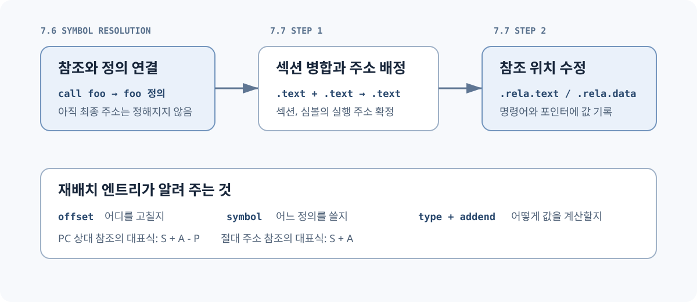
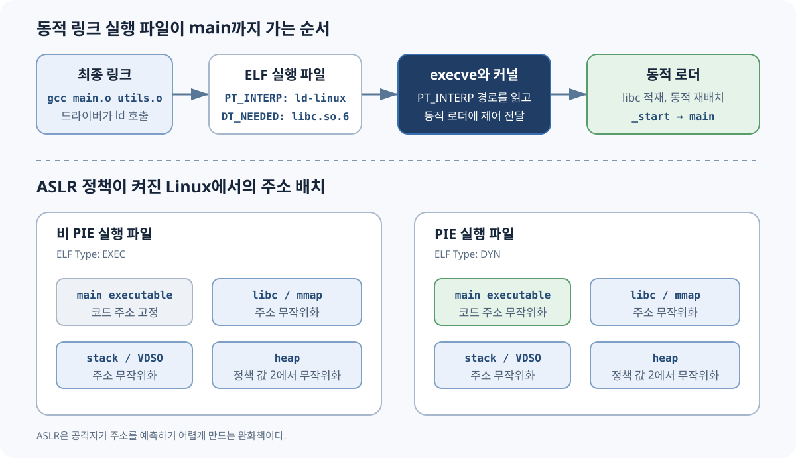
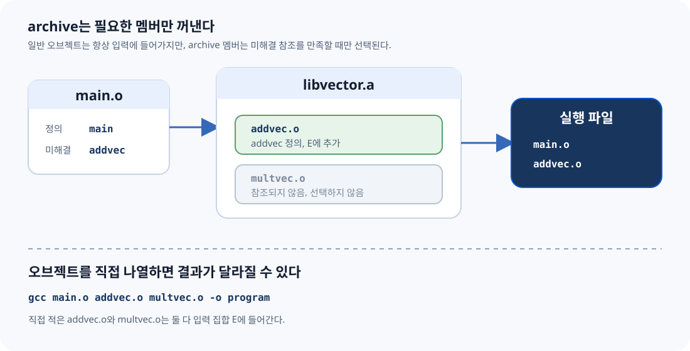
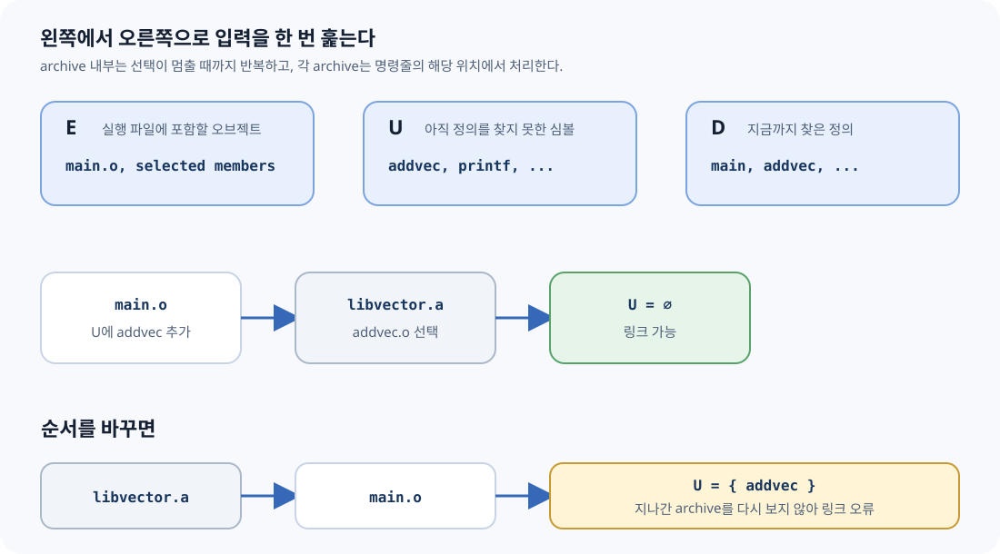

# CSAPP 7.6: 심볼 해석

> **Symbol Resolution**

> 2026-07-26 CSAPP Study · Linking

중복 심볼 이름의 해석, 정적 라이브러리, 아카이브 탐색 순서를 실제 오브젝트 파일로
확인한다. C의 tentative definition, ELF의 `SHN_COMMON`, GCC 10의
`-fno-common` 변경도 함께 다룬다.

- 기준 절: CSAPP 3e §7.6.1, §7.6.2, §7.6.3
- 검증 도구: GCC 13.3, Clang 18.1, GNU ld 2.42, lld 18.1
- 검증 환경: Ubuntu 24.04 aarch64
- HTML 버전: [chapter-7.6.1.html](chapter-7.6.1.html)
- 참고문헌: [references.md](references.md)
- 전체 검증 로그: [verified-linux-aarch64.txt](results/verified-linux-aarch64.txt)

## 목차

1. [무엇이 책이고, 무엇이 현대 보충인가](#reading)
2. [ELI5: 이름표가 겹친 물품 창고](#eli5)
3. [링커 문맥 복원](#context)
4. [CSAPP의 strong / weak 세 규칙](#rules)
5. [교재의 weak와 ELF의 WEAK](#elf-truth)
6. [CSAPP 7.6.1의 다섯 사례](#book-cases)
7. [tentative definition, COMMON, .bss, .data](#storage)
8. [GCC 10의 -fno-common 전환](#gcc10)
9. [nm, readelf, objdump 실험](#lab)
10. [GNU ld와 lld](#linkers)
11. [QUIZ](#practice)
12. [용어 사전](#glossary)
13. [책의 절·예제·그림 대응표](#mapping)
14. [보충 규칙 4가지](#beyond-book)
15. [컴파일러 드라이버와 libc](#driver-libc)
16. [동적 로더, ASLR, PIC, PIE](#loader-aslr)
17. [7.6.2 정적 라이브러리](#static-libraries)
18. [7.6.3 아카이브 탐색](#archive-search)
19. [적용 원칙](#beyond)

<a id="reading"></a>

## 무엇이 책이고, 무엇이 현대 보충인가

- **[CSAPP]**: 3판 7.6의 중복 이름 규칙, 정적 라이브러리, 아카이브 탐색 알고리즘을 다룬다.
- **[OFFICIAL]**: C11 초안, System V ELF ABI, GCC·Clang·GNU ld·lld 공식 문서와 정오표를 뜻한다.
- **[COMMENTARY]**: 교재와 현대 도구 사이의 차이, 실험 해석, 실무 안전 규칙을 명시적으로 덧붙인다.

> **WARNING · 2015년 책의 기본값과 2026년 도구는 다르다**
>
> 책의 weak 전역 예제는 과거 GCC의 `-fcommon` 기본 동작을 전제로 한다. GCC 10부터 기본값은 `-fno-common`이다. 따라서 책의 “조용히 합쳐진다”는 예제를 현재 GCC에서 그대로 실행하면 기본 설정에서는 링크 오류가 난다.

전체 근거와 조사 한계는 [references.md](references.md), 전체 검증 로그는 [verified-linux-aarch64.txt](results/verified-linux-aarch64.txt)에 있다.

<a id="eli5"></a>

## ELI5: 이름표가 겹친 물품 창고

> **ELI5**
>
> 핵심은 하나다. 같은 이름이 겹치면 링커는 확정된 정의가 몇 개인지 센다.
> 여러 반이 `x`라는 이름표를 붙인 상자를 창고에 맡긴다고 하자. 확정 상자가 둘이면
> 어느 것을 써야 할지 정할 수 없어 멈춘다. 확정 상자가 하나면 그것을 쓰고,
> 자리만 요청한 상자만 있으면 한 자리로 합친다.

### 확정 상자 둘

`strong + strong`

링크 오류

### 확정 + 임시

`strong + weak/common`

strong 선택

### 임시 상자들

`weak/common + weak/common`

하나로 병합 또는 하나 선택

<a id="context"></a>

## REMIND: 7.6에 도착하기 전 알아야 할 것

> **REMIND · 7.1–7.5 압축 복원**
>
> 각 **번역 단위(translation unit)**는 따로 컴파일된다. 컴파일러는 다른 `.c` 파일의 내부를 보지 못한 채 재배치 가능 오브젝트 **(relocatable object file)**를 만든다. 여러 파일의 전역 이름이 처음 만나는 시점은 링크 단계다.


**FIGURE N1** 컴파일러 드라이버에서 링커까지.

### 링커가 하는 두 가지 일

#### 1. 심볼 해석 (symbol resolution)

각 심볼 참조를 정확히 하나의 정의에 연결한다. 일반 오브젝트의 중복 정의를 처리하고,
필요한 정적 라이브러리 멤버를 고르는 과정까지 7.6에서 다룬다.

#### 2. 재배치 (relocation)

심볼 해석이 끝나도 컴파일 시점의 `call foo`에는 `foo`의 최종 주소가 없다. 링커는 먼저
각 오브젝트의 같은 종류 섹션을 합친다. 예를 들어 여러 입력 `.text`를 출력 `.text`로
배치하고, 출력 섹션과 각 심볼에 실행 주소를 부여한다.

그다음 `.rela.text`, `.rela.data` 같은 **재배치 엔트리(relocation entry)**를 읽는다.
재배치 엔트리는 고칠 위치, 참조할 심볼, 계산 방식, 보정값을 기록한다. 링커는 이 정보로
명령어의 주소 변위와 데이터의 포인터 값을 수정한다.



**FIGURE N2** 심볼 해석에서 재배치로 넘어가는 순서.

대표식에서 `S`는 심볼 주소, `A`는 보정값(addend), `P`는 수정할 위치의 주소다.

- PC 상대 참조: `S + A - P`
- 절대 주소 참조: `S + A`

예를 들어 x86-64의 `call foo`는 보통 `R_X86_64_PLT32` 또는
`R_X86_64_PC32` 재배치를 사용한다. 링커가 `foo`의 주소를 정한 뒤 호출 명령의
32비트 변위 필드를 고친다. 실제 재배치 종류와 비트 배치는 ISA와 ABI마다 다르다.
7.7에서는 섹션 재배치와 심볼 참조 재배치 알고리즘을 이 순서로 다룬다.

**AArch64 오브젝트 · OBSERVED**

```text
$ readelf -Wr driver-main-gcc.o
Offset  Type              Symbol's Name + Addend
0x48    R_AARCH64_CALL26  foo + 0

$ objdump -dr driver-main-gcc.o
48: 94000000  bl  0 <foo>
    48: R_AARCH64_CALL26  foo
```

`94000000`의 분기 대상 필드는 아직 완성되지 않았다. 링크 시 `foo`의 최종 주소가
정해지면 `R_AARCH64_CALL26` 규칙에 맞춰 이 명령어의 즉시값을 수정한다.

### 세 종류의 링커 심볼

**global definition**

모듈이 정의하고 다른 모듈에서도 참조할 수 있는 비정적 함수와 전역 변수.

**local definition**

`static`으로 내부 연결을 갖는 함수·파일 범위 변수. 같은 이름이 다른 오브젝트에 있어도 충돌하지 않는다.

**external reference**

현재 모듈이 참조하지만 정의하지 않은 심볼. ELF에서는 보통 `SHN_UNDEF`.

> **COMMON MISTAKE · local symbol ≠ local variable**
>
> 여기서 local symbol은 오브젝트 파일 밖에서 보이지 않는 심볼이다. 함수 안 자동 지역 변수는 보통 런타임 스택이나 레지스터에 놓이며 링커의 전역 이름 해석 대상이 아니다.

<a id="rules"></a>

## CSAPP의 strong / weak 세 규칙

**[CSAPP]** 교재는 Linux 컴파일 시스템의 중복 이름 처리를 다음 모델로 설명한다. 함수와 초기화된 전역 변수는 strong, 초기화되지 않은 전역 변수는 weak로 분류한다.

- **strong 정의가 둘 이상이면 오류**: 같은 이름의 강한 정의는 하나만 존재해야 한다. 함수 중복 정의도 여기에 포함된다.
- **strong 정의 하나를 선택**: strong 하나와 weak 여러 개가 있으면 strong 정의가 모든 참조를 만족한다.
- **weak 정의 중 하나를 선택**: weak만 여러 개면 어느 하나를 고른다. 어떤 것을 고를지 프로그램이 가정하면 안 된다.


**FIGURE N3** 교재의 세 규칙을 적용하는 순서.

> **WARNING · arbitrary는 random이 아니다**
>
> “아무 weak나 고른다”는 매 실행마다 무작위라는 뜻이 아니다. 특정 링커 버전과 입력 순서에서는 결과가 반복될 수 있다. 뜻은 **소스 언어 수준에서 이식 가능한 선택을 보장하지 않는다**는 것이다.

<a id="elf-truth"></a>

## 가장 중요한 구분: 교재의 weak와 ELF의 WEAK

**[OFFICIAL · ELF ABI]** ELF 심볼 표의 `Bind`에는 `LOCAL`, `GLOBAL`, `WEAK`가 있다. `SHN_COMMON`은 binding이 아니라 **특별한 section index**다.

> **GOTCHA · 책의 weak 분류를 readelf의 WEAK로 번역하지 말 것**
>
> GCC `-fcommon`에서 파일 범위 `int x;`를 컴파일하면 실제 출력은 대개 `OBJECT GLOBAL DEFAULT COM x`다. 즉 `Bind=GLOBAL`, `Ndx=COM`이며 `Bind=WEAK`가 아니다.

| C 표기 | 교재 모델 | 현대 GCC ELF 관측 | `nm` | 중복 시 |
| --- | --- | --- | --- | --- |
| `int f(void) {…}` | strong | `FUNC GLOBAL .text` | `T` | 두 정의면 오류 |
| `int x = 7;` | strong | `OBJECT GLOBAL .data` | `D` | 두 정의면 오류 |
| `int x = 0;` | strong | `OBJECT GLOBAL .bss` | `B` | 두 정의면 오류 |
| `int x;` + `-fcommon` | weak | `OBJECT GLOBAL COM` | `C` | COMMON 병합 가능 |
| `int x;` + `-fno-common` | 책 이후 기본값 | `OBJECT GLOBAL .bss` | `B` | 여러 번역 단위면 오류 |
| `__attribute__((weak))` | 명시적 weak | `OBJECT WEAK .data` | `V` | GLOBAL 정의가 우선 |


**FIGURE N4** 심볼 표 병합의 개념도. LOCAL은 오브젝트별 이름 공간에 남는다.

### 실제 출력으로 확인

**GCC 13.3 · -fcommon · OBSERVED**

```text
$ readelf -Ws sc-worker.o | grep ' x$'
16: 0000000000000004  4 OBJECT  GLOBAL DEFAULT  COM x

$ nm -S sc-worker.o
0000000000000004 0000000000000004 C x
```

**명시적 ELF weak attribute · OBSERVED**

```text
$ readelf -Ws ew-provider.o | grep ' hook$'
17: 0000000000000000  4 OBJECT  WEAK   DEFAULT  3 hook

$ nm -S ew-provider.o
0000000000000000 0000000000000004 V hook
```

<a id="book-cases"></a>

## CSAPP 7.6.1의 다섯 사례

### 사례 1 · `main` 함수가 두 개

두 모듈 모두 `main` 함수를 정의한다. 함수 정의는 strong이므로 Rule 1에 따라 링크 오류다. “어느 main이 먼저인가”를 따질 단계가 아니다.

**duplicate-function · OBSERVED · GNU ld**

```text
multiple definition of `helper';
df-main.o: first defined here
collect2: error: ld returned 1 exit status
```

### 사례 2 · 초기화된 전역 `x`가 두 개

두 모듈이 모두 `int x = 15213;` 같은 초기화된 전역을 정의한다. 둘 다 strong이므로 함수 중복과 똑같이 링크 오류다. 값이 우연히 같아도 동일한 저장 객체라는 증거가 아니므로 허용되지 않는다.

### 사례 3 · 초기화된 `x` + 초기화되지 않은 `x`

과거 기본값 또는 `-fcommon`에서는 첫 모듈의 초기화된 `x`가 strong, 다른 모듈의 `int x;`가 COMMON 후보가 된다. strong 정의가 선택되고, 다른 모듈의 함수도 그 같은 저장 공간을 쓴다. 책의 결과처럼 `update()`가 호출자 모르게 값을 바꿀 수 있다.

**strong-common · OBSERVED**

```text
$ nm -S sc-main.o sc-worker.o | grep ' x$'
0000000000000000 0000000000000004 D x
0000000000000004 0000000000000004 C x

$ ./strong-common
x = 15212
```

### 사례 4 · 초기화되지 않은 `x`가 두 개

`-fcommon`에서는 두 tentative definition이 COMMON으로 나온다. GNU ld는 하나의 저장 공간으로 병합하며, `--warn-common`을 주면 이 조용한 병합을 경고로 드러낼 수 있다. 현대 기본 `-fno-common`에서는 둘 다 `.bss` 정의이므로 오류다.

**common-common · OBSERVED · -fcommon**

```text
$ gcc -Wl,--warn-common cc-main.o cc-worker.o -o common-common
ld: cc-worker.o and cc-main.o: warning: multiple common of `x'
$ ./common-common
x = 15212
```

### 사례 5 · 이름은 같고 타입은 다르다

한 모듈은 `int x`, 다른 모듈은 `double x`라고 믿는다. 링커의 주된 해석 키는 C 타입이 아니라 심볼 이름과 오브젝트 메타데이터다. `-fcommon`에서 strong `int`가 선택되면, 다른 모듈은 같은 주소에 8바이트 `double`을 쓸 수 있다. 인접 객체가 덮일 수 있는 심각한 버그다.

> **WARNING · 출력 값은 시스템 의존**
>
> 책의 x86-64 예시는 `x`와 바로 다음 `y`가 함께 손상되는 한 배치를 보여 준다. CSAPP 공식 정오표는 정확한 손상 값이 시스템 의존이라고 명시한다. 본 aarch64 실험에서는 `x=0`이 되었지만 `y`는 유지됐다. 어느 쪽도 프로그램이 의존할 수 있는 결과가 아니다.

**common-mismatch · OBSERVED · aarch64**

```text
ld: warning: common of `x' overridden by definition
ld: warning: alignment 4 of normal symbol `x' is smaller than 8
ld: warning: alignment discrepancies can cause real problems

$ ./common-mismatch
x = 0x0 y = 0x3b6c
```


**FIGURE N5** 실패보다 위험할 수 있는 조용한 성공.

<a id="storage"></a>

## tentative definition, COMMON, .bss, .data

**[OFFICIAL · C11 §6.9.2]** 파일 범위 객체 선언에 initializer가 없고 적절한 storage-class 조건을 만족하면 **tentative definition(잠정 정의)**이다. 같은 번역 단위 안에 실제 외부 정의가 끝까지 없다면 0 initializer를 가진 정의처럼 동작한다.

> **NOTE · C 언어 규칙과 ELF 배치는 다르다**
>
> C 표준은 “프로그램 시작 시 0으로 초기화된 객체”라는 의미를 규정한다. 그것을 오브젝트 파일에서 COMMON으로 낼지 `.bss`로 낼지는 컴파일러와 플랫폼의 구현 선택이다.


**FIGURE N6** 입력 오브젝트와 최종 실행 파일의 저장 위치. COMMON 자체는 입력 섹션이 아니다.

| 표현 | 정의/선언 | `-fcommon` 입력 .o | `-fno-common` 입력 .o | 최종 메모리 |
| --- | --- | --- | --- | --- |
| `int a = 7;` | 외부 정의 | `.data` | `.data` | 쓰기 가능한 초기화 데이터 |
| `int b = 0;` | 외부 정의 | `.bss` | `.bss` | 0으로 초기화 |
| `int c;` | tentative definition | `SHN_COMMON` | `.bss` | 최종적으로 보통 `.bss` |
| `extern int d;` | 선언/참조 | `SHN_UNDEF` | `SHN_UNDEF` | 다른 정의가 제공해야 함 |
| `static int e;` | 내부 연결 tentative | `.bss LOCAL` | `.bss LOCAL` | 모듈 전용 0 초기화 객체 |

> **COMMON MISTAKE · “COMMON section”을 실제 섹션이라고 생각하기**
>
> ELF `SHN_COMMON` 심볼은 아직 어느 입력 섹션에도 할당되지 않았다. `st_value`는 주소가 아니라 정렬 조건이고, `st_size`가 필요한 바이트 수다. GNU ld 스크립트의 `*(COMMON)`은 이런 심볼을 출력 `.bss`에 배치하기 위한 특별 표기다.

<a id="gcc10"></a>

## GCC 10: 실수를 허용하던 기본값을 뒤집다

**[OFFICIAL · GCC 10 PORTING GUIDE]** GCC 10은 C에서도 `-fno-common`을 기본으로 바꿨다. 헤더에 `int x;`를 써 여러 파일에서 정의를 만들어 버리는 실수를 링크 오류로 드러내고, 일부 target에서는 더 효율적인 전역 접근도 가능하게 한다.


**FIGURE N7** GCC 10 전후의 기본 정책. 본 실험은 현재 GCC에서 두 플래그를 명시해 같은 의미를 재현했다.

### 과거 의미 재현

**-fcommon · PASS**

```text
gcc -fcommon -c main.c worker.c
gcc main.o worker.o -o before
./before
x = 15212
```

### 현대 기본 의미 재현

**-fno-common · EXPECTED ERROR**

```text
gcc -fno-common -c main.c worker.c
gcc main.o worker.o -o after
multiple definition of `x'
```

### Clang 18에서도 플래그의 의미는 같다

**Clang 18.1.3 + lld 18.1.3 · OBSERVED**

```text
$ clang -c main.c worker.c
# 기본 출력: x는 각 .o의 .bss GLOBAL 정의 → duplicate symbol 오류

$ clang -fcommon -c main.c worker.c
# x는 GLOBAL COM → 링크 성공, x = 15212

$ clang -fno-common -c main.c worker.c
# x는 각 .o의 .bss GLOBAL 정의 → duplicate symbol 오류
```

### 고치는 방법

**전역 변수의 단일 정의 패턴 · RECOMMENDED**

```c
/* state.h: 공간을 만들지 않는 선언 */
extern int x;

/* state.c: 프로그램 전체에서 정확히 하나인 정의 */
int x = 0;

/* user.c: 헤더를 통해 같은 객체를 참조 */
#include "state.h"
```

> **COMMON MISTAKE · 링크가 되게 하려고 -fcommon만 되돌리기**
>
> 레거시 이행을 위해 임시로 쓸 수는 있지만, 중복 정의 설계를 그대로 숨긴다. 먼저 헤더의 정의를 `extern` 선언으로 바꾸고 한 구현 파일에만 정의를 둔다.

<a id="lab"></a>

## 실험실: nm, readelf, objdump로 증거 읽기

아래 출력은 [verify-elf.sh](verify-elf.sh)를 Ubuntu 24.04 aarch64 컨테이너에서 실행한 결과다. macOS의 `gcc`는 Apple Clang이며 Mach-O를 만들기 때문에, ELF 설명과 섞지 않았다.

### `nm` 한 글자 해독표

#### `D` / `d`

초기화된 data. 대문자는 보통 global, 소문자는 local.

#### `B` / `b`

BSS의 0 초기화·미초기화 데이터.

#### `C`

아직 할당되지 않은 common symbol.

#### `T` / `t`

text 영역의 함수·코드.

#### `U`

현재 오브젝트에는 정의가 없는 참조.

#### `V` / `W`

실제 weak object / weak non-object.

### 같은 소스, 다른 section index

**storage-layout/symbols.c · OBSERVED**

```text
$ nm -S layout-common.o
0000000000000000 0000000000000004 D initialized
0000000000000004 0000000000000004 C tentative
0000000000000000 0000000000000004 B zero

$ nm -S layout-nocommon.o
0000000000000000 0000000000000004 D initialized
0000000000000000 0000000000000004 B tentative
0000000000000004 0000000000000004 B zero
```

### `static`은 이름을 파일 안에 가둔다

**static-internal · OBSERVED**

```text
$ ./static-internal
main.x=11 other.x=22
$ nm -a static-internal | grep ' [bd] x$'
0000000000020010 d x
0000000000020014 d x
```

소문자 `d`는 두 `x`가 각각 local data symbol임을 보인다. 소스 이름은 같지만 외부 연결 이름 공간에 나오지 않으므로 충돌하지 않는다.

### 직접 재현

**macOS에서도 ELF를 똑같이 재현 · DOCKER**

```text
cd chapter07
./verify-in-docker.sh

# HTML과 Markdown의 로컬 링크·필수 블록도 검사
node verify-html.mjs
```

> **NOTE · 재현 환경**
>
> `.o`는 CPU, 운영체제, 컴파일러에 따라 달라진다. 저장소에는 소스와 재생성 명령,
> 검증 결과를 남기고 `examples/build/`의 바이너리는 추적하지 않는다.

<a id="linkers"></a>

## GNU ld와 lld: 규칙은 같고 진단은 다르다

### GNU ld 2.42

**strong + strong · ERROR**

```text
multiple definition of `conflict';
ss-main.o: first defined here
```

### lld 18.1.3

**strong + strong · ERROR**

```text
duplicate symbol: conflict
>>> defined at main.c:3
>>> defined at other.c:1
```

둘 다 기본적으로 중복 strong 정의를 거부한다. lld는 각 정의의 소스 위치를 구조적으로 보여 줬고, GNU ld는 “first defined here” 형태로 보여 줬다.

### 실제 WEAK + WEAK 입력 순서 실험

**GNU ld와 lld에서 같은 관측 · OBSERVED, NOT GUARANTEED**

```text
$ cc main.o left.o right.o -o left-first && ./left-first
choice=11
$ cc main.o right.o left.o -o right-first && ./right-first
choice=22

$ clang -fuse-ld=lld main.o left.o right.o -o lld-left && ./lld-left
choice=11
$ clang -fuse-ld=lld main.o right.o left.o -o lld-right && ./lld-right
choice=22
```

> **WARNING · 관측을 계약으로 승격하지 말 것**
>
> 이 버전의 두 링커는 먼저 입력된 weak 정의를 골랐다. 그러나 ELF ABI는 weak 동작의 일부를 implementation-defined로 두고, 교재도 “어느 weak든”이라고 표현한다. 입력 순서로 기능 선택을 설계하지 말고, 명시적 strong 정의나 등록 메커니즘을 사용한다.

### escape hatch: `--allow-multiple-definition`

GNU ld와 lld 공식 문서는 이 옵션을 주면 여러 정의를 오류로 처리하지 않고 첫 정의를 쓴다고 설명한다. 바이너리 분석·특수 빌드에는 쓸 수 있지만, 일반 애플리케이션의 중복 정의 버그를 고치는 수단은 아니다.

<a id="practice"></a>

## QUIZ

### QUIZ

#### Q1. `int x = 0;`은 초기값이 0이므로 weak인가?

<details>
<summary>정답 보기</summary>

아니다. 교재 모델에서 initializer가 있으므로 strong이다. ELF에서는 보통 `GLOBAL`
객체로 `.bss`에 놓인다.

</details>

#### Q2. `readelf`의 `GLOBAL DEFAULT COM`은 ELF weak symbol인가?

<details>
<summary>정답 보기</summary>

아니다. binding은 `GLOBAL`이고 section index가 `SHN_COMMON`이다. 실제 weak binding은
`WEAK`로 표시된다.

</details>

#### Q3. 두 파일에 `static int x;`가 있으면 왜 링크 오류가 아닌가?

<details>
<summary>정답 보기</summary>

`static` 파일 범위 객체는 내부 연결을 가진다. 각 오브젝트의 local symbol이라 서로 다른
이름 공간에 있다.

</details>

#### Q4. GCC 10 이후 여러 파일의 `int x;`가 기본 설정에서 실패하는 이유는?

<details>
<summary>정답 보기</summary>

기본 `-fno-common`이 각 tentative definition을 오브젝트의 `.bss` GLOBAL 정의로 내므로,
링커가 여러 strong 정의로 보고 거부한다.

</details>

### Practice Problem 7.2 대응

<details>
<summary>A. 함수 `main` + tentative object `main`</summary>

함수 정의가 strong, tentative object가 weak/common인 과거 모델에서는 두 참조 모두 함수 정의 쪽에 연결된다. 그러나 함수와 객체가 같은 이름을 공유하는 설계 자체가 타입 안전하지 않다.

</details>

<details>
<summary>B. 함수 `main` + 초기화된 object `main`</summary>

둘 다 strong이므로 Rule 1 링크 오류다.

</details>

<details>
<summary>C. tentative `int x` + initialized `double x`</summary>

과거 모델에서는 initialized `double` strong 정의가 선택되어 두 참조가 그 정의로
해석된다. C 타입 관점에서는 위험한 불일치다. 현대 `-fno-common` 기본에서는 두 정의로
오류가 난다.

</details>

### EXERCISE

1. `examples/storage-layout/symbols.c`에 `static int s;`와 `int z = 0;`을 추가하고 `readelf -Ws`의 Bind/Ndx를 예측한 뒤 확인한다.
2. `common-common`의 두 `x`를 각각 `char x[4]`, `char x[32]`로 바꾸고 `-fcommon -Wl,--warn-common`에서 GNU ld가 어떤 크기를 택하는지 확인한다.
3. `explicit-weak`의 strong 정의를 제거하고 weak 정의만 남긴 뒤 `nm`과 실행 결과를 비교한다.
4. 헤더에 `int counter;`를 둔 잘못된 3파일 프로그램을 만들고, `extern` + 단일 정의 패턴으로 고친다.

### 추가 확인

#### 컴파일 오류와 링크 오류의 차이는?

각 번역 단위의 문법과 타입은 컴파일러가 검사한다. 번역 단위 사이의 정의는 링커가 연결한다.

#### `.bss`가 파일 크기를 줄이는 이유는?

0 바이트를 파일에 모두 저장하지 않고 크기만 기록한 뒤 로더가 메모리를 0으로 채운다.

#### weak symbol은 언제 쓰는가?

기본 구현이나 선택적 hook에 쓴다. 입력 순서에 따라 기능이 바뀌게 설계하면 안 된다.

#### 헤더에는 왜 `extern`을 쓰는가?

헤더는 여러 번역 단위에 포함되므로 저장 공간을 만드는 정의가 아니라 하나의 정의를 가리키는
선언을 둔다.

<a id="glossary"></a>

## 용어 사전: 영문을 기준으로 고정하기

**symbol resolution**

심볼 해석. 각 심볼 참조를 하나의 정의에 연결하는 링크 단계.

**duplicate symbol name**

중복 심볼 이름. 여러 입력 모듈이 같은 외부 이름을 정의한 상태.

**strong symbol**

강한 심볼. CSAPP 모델에서 함수와 초기화된 전역. 같은 이름의 strong은 하나만 허용.

**weak symbol**

약한 심볼. 문맥을 밝혀야 한다. CSAPP 학습 모델인지 ELF `STB_WEAK`인지 구분한다.

**tentative definition**

잠정 정의. 파일 범위에서 initializer 없이 나온 객체 선언의 C 표준 개념.

**common symbol**

공통 심볼. ELF relocatable object에서 아직 저장 공간이 배정되지 않은 `SHN_COMMON` 심볼.

**binding**

바인딩. ELF의 `STB_LOCAL`, `STB_GLOBAL`, `STB_WEAK` 같은 가시성·우선순위 속성.

**linkage**

연결. C 식별자가 다른 범위·번역 단위의 같은 이름 선언과 같은 대상을 가리키는지 정하는 언어 개념.

**translation unit**

번역 단위. 전처리가 끝난 하나의 소스 단위. 각 단위가 독립적으로 컴파일된다.

**relocatable object file**

재배치 가능 오브젝트 파일. 심볼·재배치 정보를 가진 링커 입력 `.o`.

**relocation entry**

재배치 엔트리. 링커가 고칠 위치, 심볼, 재배치 종류, 보정값을 기록한 항목.

**compiler driver**

컴파일러 드라이버. 전처리, 컴파일, 어셈블, 링크 단계와 관련 도구를 조정하는 프로그램.

**dynamic linker / loader**

동적 링커 / 로더. 프로그램 시작 시 공유 오브젝트를 적재하고 동적 재배치를 처리한 뒤
프로그램 시작점으로 제어를 넘기는 프로그램.

**PT_INTERP**

동적 실행 파일이 사용할 프로그램 인터프리터의 경로를 담은 ELF 프로그램 헤더 항목.

**DT_NEEDED**

동적 로더가 찾아야 할 공유 오브젝트 이름을 담은 ELF 동적 섹션 항목.

**position-independent code (PIC)**

위치 독립 코드. 특정 절대 적재 주소에 묶이지 않도록 PC 상대 주소, GOT, PLT,
동적 재배치 등을 사용하는 코드.

**position-independent executable (PIE)**

위치 독립 실행 파일. 운영체제가 주 실행 파일을 다른 기준 주소에 적재할 수 있는
실행 파일.

**address space layout randomization (ASLR)**

주소 공간 배치 무작위화. 실행할 때 코드, 공유 라이브러리, 스택, 힙 등의 주소 예측을
어렵게 만드는 운영체제 보안 정책.

**static library / archive**

정적 라이브러리 / 아카이브. 여러 `.o`와 심볼 인덱스를 묶은 파일. 링커가 필요한 멤버만
선택할 수 있다.

**backward reference**

역방향 참조. 명령줄에서 뒤의 입력이 이미 지나간 앞의 아카이브 멤버를 요구하는 참조.

**multiple definition**

다중 정의. 하나여야 하는 외부 strong 정의가 둘 이상인 링크 오류.

**internal linkage**

내부 연결. 파일 범위 `static`처럼 현재 번역 단위 안에서만 같은 대상을 가리킴.

<a id="mapping"></a>

## 책의 절·예제·그림 대응표

| CSAPP 3e 요소 | 책의 역할 | 설명 위치 | 재현 실습 |
| --- | --- | --- | --- |
| 절 도입 | 여러 모듈의 같은 전역 이름 문제 제기 | §2–§4 | 전체 |
| Strong/weak Rule 1–3 | Linux 링커 선택 규칙 | §3 결정 트리 | `strong-strong`, `common-common`, `weak-weak` |
| `foo1/bar1` | 중복 `main` 함수 | §5 사례 1 | `duplicate-function` |
| `foo2/bar2` | 초기화된 `x` 중복 | §5 사례 2 | `strong-strong` |
| `foo3/bar3` | strong + uninitialized global | §5 사례 3 | `strong-common` |
| `foo4/bar4` | uninitialized global 둘 | §5 사례 4 | `common-common` |
| `foo5/bar5` | `int`/`double` 타입 불일치와 손상 | §5 사례 5 | `common-mismatch` |
| COMMON과 `.bss` 설명 | 컴파일러가 결정을 링커에 미루는 이유 | §6 | `storage-layout` |
| Practice Problem 7.2 | REF → DEF 규칙 연습 | §10 | QUIZ |
| 7.6.2 | 정적 라이브러리의 필요성과 archive 구성 | 정적 라이브러리 | `static-library` |
| Figure 7.6 | `libvector.a`의 멤버 구성 | 정적 라이브러리 | `ar t`, `nm -s` |
| Figure 7.7 | `main2.c`가 `addvec`를 참조 | 정적 라이브러리 | `static-library/main.c` |
| Figure 7.8 | 필요한 archive member만 복사 | 정적 라이브러리 | `vector-archive`, `vector-objects` |
| 7.6.3 | `E`, `U`, `D`를 이용한 왼쪽부터의 탐색 | 아카이브 탐색 | wrong order, archive cycle |
| Practice Problem 7.3 | 라이브러리 의존 관계에 맞춘 링크 순서 | 아카이브 탐색 QUIZ | `archive-cycle` |

<a id="beyond-book"></a>

## 보충 규칙 4가지

### 1. 같은 번역 단위 안의 잠정 정의는 하나로 정리된다

C11 §6.9.2에 따르면 같은 번역 단위 안의 `int x;`가 여러 번 나와도, 호환되는 선언이라면
번역 단위 끝에서 하나의 0 초기화 정의처럼 동작한다. 이 단계는 오브젝트 파일이 생기기
전이므로 링커의 “중복 strong” 문제가 아니다. 또한 initializer가 붙은
`extern int x = 3;`은 선언이 아니라 **정의**다.

**C11 규칙 · N1570 §6.9.2**

```c
int x;              /* tentative definition */
int x;              /* 같은 번역 단위: 같은 객체 */
extern int y = 3;   /* initializer가 있으므로 definition */
int a[];            /* 끝까지 불완전하면 0인 원소 하나의 배열 */
```

### 2. 크기가 다른 COMMON은 가장 큰 저장 공간을 택한다

GNU ld는 같은 이름의 COMMON들이 크기가 다르면 가장 큰 크기를 사용한다. ELF `.comm`은
크기뿐 아니라 정렬 조건도 전달한다. 이것은 타입 검사가 아니라 바이트 수와 정렬의
병합이므로, 링크 성공만으로 타입이 일치한다고 판단하면 안 된다.

**common-size · OBSERVED · GNU ld 2.42**

```text
$ nm -S cs-small.o cs-large.o | grep ' arena$'
0000000000000004 0000000000000004 C arena
0000000000000020 0000000000000020 C arena

$ gcc -Wl,--warn-common cs-main.o cs-small.o cs-large.o -o common-size
ld: warning: common of `arena' overriding smaller common
$ nm -S common-size | grep ' arena$'
0000000000020018 0000000000000020 B arena
```

### 3. 정의되지 않은 실제 ELF weak는 0으로 남을 수 있다

System V ELF ABI에서 해결되지 않은 `STB_WEAK` 참조는 링크 오류가 아니라 0 값을 갖는다.
또한 undefined weak 하나만 만족시키기 위해 정적 라이브러리의 멤버를 꺼내지 않는다.
선택적 hook을 만들 수 있지만, 함수 포인터가 0인지 확인하지 않고 호출하면 안 된다.

**weak-undefined · OBSERVED**

```text
$ gcc wu-main.o liboptional.a -o weak-archive
$ nm weak-archive | grep optional_hook
                 w optional_hook
$ ./weak-archive
optional_hook: absent

$ gcc wu-main.o wu-provider.o -o weak-explicit && ./weak-explicit
optional_hook: present
```

### 4. LTO는 번역 단위 사이 타입 불일치를 추가로 볼 수 있다

일반 정적 링커는 C 타입 전체를 비교하지 않지만, GCC의
**link-time optimization(LTO)**은 중간 표현(IR)을 함께 보므로 `-Wlto-type-mismatch`
진단을 낼 수 있다. 이 경고는 `-flto`가 있을 때만 가능하며, 올바른 해결책은 여전히
선언을 한 헤더로 통일하고 정의를 하나만 두는 것이다.

**common-mismatch + -flto · OBSERVED · GCC 13.3**

```text
worker.c:1:8: warning: type of 'x' does not match original declaration
main.c:4:5: note: type 'int' should match type 'double'
main.c:4:5: note: code may be misoptimized
```

### 적용 범위

이 결정 트리는 C 재배치 가능 오브젝트의 정적 링크를 설명한다. C++의 ODR·COMDAT,
JVM의 constant pool 기반 method resolution, shared object의 동적 심볼 검색은 별도
규칙을 따른다.

> **GOTCHA · name mangling을 같은 규칙으로 묶지 않는다**
>
> 현재 ELF 계열 C++ ABI의 mangled name은 보통 `_Z`로 시작한다. JVM은 class file의
> 이름과 descriptor로 symbolic reference를 해석한다. 둘을 같은 정적 링커 규칙으로
> 설명하면 안 된다.

<a id="driver-libc"></a>

## 컴파일러 드라이버와 libc

`gcc`, `clang`, `cc`는 명령줄에서 전처리, 컴파일, 어셈블, 링크 단계를 조정하는
**컴파일러 드라이버(compiler driver)**다. 옵션에 따라 한 단계에서 멈추거나 다음 도구를
호출한다.

| 명령 또는 구성 요소 | 역할 | 확인 방법 |
| --- | --- | --- |
| `gcc`, `clang`, `cc` | 전체 빌드 단계를 조정하는 드라이버 | `gcc -###`, `clang -###` |
| `cc1` | GCC의 C 컴파일러 본체. 내부 프로그램이므로 보통 직접 호출하지 않음 | `gcc -print-prog-name=cc1` |
| `cpp` | 독립 실행 가능한 C 전처리기. 현재 GCC는 기본적으로 전처리를 통합 실행 | `gcc -E file.c` |
| `as` | 어셈블러. 어셈블리 코드를 `.o`로 만듦 | `gcc -c file.s` |
| `ld`, `ld.lld` | 오브젝트와 라이브러리를 결합하는 정적 링커 | `gcc -fuse-ld=lld ...` |
| `ldd` | 실행 파일이 요구하는 동적 의존성을 표시 | `ldd a.out` |

`#include`, `#define`, 조건부 컴파일을 처리하는 단계는 전처리다. 다만 GCC 전체를
전처리기, 컴파일러, 링커, C 표준 라이브러리가 한 파일에 들어 있는 프로그램으로 이해하면
안 된다. GCC 드라이버가 설치된 도구와 파일을 찾아 조합하는 구조다.

```bash
gcc -E main.c -o main.i       # 전처리까지만
gcc -S main.i -o main.s       # C를 어셈블리로
gcc -c main.s -o main.o       # 어셈블해 오브젝트 생성
gcc main.o utils.o -o app     # 링크
```

마지막 명령은 컴파일이 아니라 링크다. `gcc` 드라이버는 링커를 호출하면서 시작 코드
`crt*.o`, 기본 라이브러리, 동적 로더 경로 같은 인수를 함께 전달한다. 반면 다음 명령은
오브젝트 두 개만 `ld`에 넘긴다.

```text
$ gcc main.o utils.o -o driver-gcc
$ printf '4\n' | ./driver-gcc
output is 64

$ ld main.o utils.o -o driver-raw-ld
ld: warning: cannot find entry symbol _start
ld: undefined reference to `__isoc99_scanf'
ld: undefined reference to `printf'
```

`ld`가 부족한 링커라서 실패한 것이 아니다. raw `ld` 명령에 시작 코드와 libc를 비롯한
필수 입력을 주지 않았기 때문이다. 실제로 GCC가 어떤 인수를 넘기는지는
`gcc -### main.o utils.o`로 확인할 수 있다.

### GCC와 C 표준 라이브러리를 구분한다

GCC는 완전한 C 표준 라이브러리 구현을 제공하지 않는다. Linux 배포판에서는 GCC가
glibc와 함께 설치되는 경우가 많지만 둘은 별도 프로젝트다. 헤더는 함수와 타입을
선언하고, 실제 구현은 정적 아카이브나 공유 오브젝트에 있다. 위치도
`/usr/include`, `/usr/lib`로 고정되지 않으며 sysroot, multiarch 디렉터리, SDK 구성에
따라 달라진다.

| 환경 | C 런타임 연결 |
| --- | --- |
| glibc | `libc.so.6`을 쓰는 동적 링크와 `libc.a`를 쓰는 정적 링크를 모두 지원. 정적 패키지가 설치되어 있어야 함 |
| musl | 동적 링크와 정적 링크를 모두 지원. 외부 런타임 의존성이 없는 Linux 실행 파일을 만들 때 자주 사용 |
| macOS | 정적 라이브러리는 지원하지만, 시스템 libc까지 포함한 완전 정적 서드파티 실행 파일은 지원하지 않음 |
| MSVC | `/MD`는 DLL CRT, `/MT`는 정적 CRT. Visual C++ Redistributable은 주로 `/MD` 실행 파일에 필요한 런타임 DLL을 배포 |

glibc가 동적 링크만 지원한다는 설명은 틀리다. 다음 실험은 Ubuntu의 `libc.a`로 정적
실행 파일을 만들었다.

```text
$ gcc -static main.o utils.o -o driver-static
$ file driver-static
ELF 64-bit LSB executable, ARM aarch64, statically linked
$ ldd driver-static
not a dynamic executable
```

glibc 정적 링크는 NSS, locale, 동적 모듈을 사용하는 기능에서 추가 제약이 생길 수 있다.
배포 대상의 glibc 호환성이 중요하면 가장 오래된 지원 환경에서 빌드하는 방식도 쓴다.
musl은 대안이지 모든 Linux 배포의 필수 선택은 아니다.

### `lld`와 `ldd`

이름은 비슷하지만 역할은 관계가 없다.

- **LLD**: LLVM 프로젝트의 링커. ELF용 실행 파일은 보통 `ld.lld`이며
  `clang -fuse-ld=lld`로 선택한다.
- **ldd**: 이미 만들어진 동적 실행 파일의 공유 라이브러리 의존성을 표시한다. 링크 작업을
  하지 않는다. 신뢰할 수 없는 실행 파일에는 직접 실행하지 않는 편이 안전하다.

<a id="loader-aslr"></a>

## 동적 로더, ASLR, PIC, PIE

### `ld-linux`의 핵심 역할은 프로그램 인터프리터다

`gcc main.o utils.o`가 성공하는 직접적인 이유는 GCC 드라이버가 시작 코드와 기본
라이브러리, 동적 로더 정보를 링크 명령에 추가하기 때문이다. Linux에서 동적 링크
실행 파일을 만들면 ELF에는 보통 다음 두 정보가 들어간다.

- `PT_INTERP`: 실행할 **프로그램 인터프리터(program interpreter)** 경로
- `DT_NEEDED`: 실행에 필요한 공유 오브젝트 이름

```text
$ readelf -l driver-gcc | grep -E 'INTERP|Requesting'
INTERP
    [Requesting program interpreter: /lib/ld-linux-aarch64.so.1]

$ readelf -d driver-gcc | grep NEEDED
Shared library: [libc.so.6]
Shared library: [ld-linux-aarch64.so.1]
```

x86-64 glibc 환경에서는 인터프리터 경로가 흔히
`/lib64/ld-linux-x86-64.so.2`다. 이 경로는 CPU 아키텍처와 배포판 구성에 따라
달라진다. `ldd` 출력만으로는 프로그램 인터프리터와 일반 공유 라이브러리 의존성을
구분할 수 없다. `readelf -l`의 `PT_INTERP`와 `readelf -d`의 `DT_NEEDED`를 따로
확인해야 한다.

위 AArch64 실험에서는 동적 로더가 `PT_INTERP`와 `DT_NEEDED`에 모두 나타났다. glibc가
설치하는 `libc.so`는 실제 공유 오브젝트가 아니라 `libc.so.6`, `libc_nonshared.a`,
동적 로더를 묶는 GNU ld 스크립트일 수 있다. 이 스크립트의 `AS_NEEDED` 처리 결과로
동적 로더가 `DT_NEEDED`에도 남을 수 있다. 반면 다른 glibc 환경에서는
`DT_NEEDED`에 `libc.so.6`만 나타나기도 한다. 실행 시작 시 사용할 로더를 정하는
정보는 두 경우 모두 `PT_INTERP`다.

프로그램을 실행하면 커널은 `PT_INTERP`에 적힌 동적 로더를 함께 적재하고 로더에 먼저
제어를 넘긴다. 동적 로더는 `DT_NEEDED` 항목을 따라 `libc.so.6` 같은 공유 오브젝트를
찾아 메모리에 매핑하고 동적 재배치를 처리한다. 그다음 프로그램의 시작점 `_start`로
제어를 넘기며, C 런타임 초기화가 끝난 뒤 `main`이 호출된다. 따라서 `main`이 프로세스에서
가장 먼저 실행되는 함수는 아니다.



**FIGURE N10** 동적 로더의 실행 순서와 ASLR 적용 범위.

### ASLR은 주소 예측을 어렵게 만든다

**ASLR(Address Space Layout Randomization)**은 프로세스 주소 공간의 배치를
무작위화하는 보안 완화책이다. OSTEP은 고정된 주소에 의존하는 return-to-libc와 ROP
공격을 어렵게 만드는 방어로 ASLR을 설명한다.

Linux의 `/proc/sys/kernel/randomize_va_space` 값은 일반적으로 다음 범위를 제어한다.

| 값 | 무작위화 범위 |
| --- | --- |
| `0` | ASLR 비활성화 |
| `1` | `mmap` 기준 주소, 공유 라이브러리, 스택, VDSO. PIE 실행 파일의 코드 시작 주소도 포함 |
| `2` | 값 `1`의 범위와 힙 |

과거 시스템의 메인 실행 파일 코드, 스택, 힙이 모두 링커가 정한 하나의 절대 주소에
고정되어 있었다고 설명하면 부정확하다. 전통적인 `ET_EXEC` 파일의 코드와 데이터는
링크 시 정한 가상 주소에 적재되는 경우가 많았고, 스택과 힙은 운영체제가 관례적인
위치에 비교적 예측 가능하게 배치했다.

ASLR은 취약점을 없애지 않는다. 주소를 알아내는 정보 누출이 있거나 무작위화 범위가
좁으면 우회될 수 있다. 메모리 안전성 검사, 스택 보호, NX, 제어 흐름 보호 같은 기법과
함께 쓰는 완화책이다.

### 비 PIE 프로그램도 ASLR 전체가 꺼지는 것은 아니다

오래된 비 PIE 실행 파일을 실행하기 위해 ASLR을 전부 꺼야 한다는 설명은 틀리다.
ASLR이 켜진 Linux에서도 비 PIE 실행 파일의 스택, `mmap` 영역, 공유 라이브러리는
무작위화될 수 있다. 보통 고정되는 부분은 주 실행 파일의 코드 주소다.

반면 **PIE(Position Independent Executable)**는 주 실행 파일도 다른 기준 주소에
적재할 수 있게 만든 실행 파일이다. ASLR과 함께 사용하면 `main`을 포함한 실행 파일의
코드 시작 주소도 실행할 때마다 달라질 수 있다.

```text
$ gcc -fPIE -pie addresses.c -o addresses-pie
$ gcc -fno-pie -no-pie addresses.c -o addresses-no-pie

$ readelf -h addresses-pie | grep Type
Type: DYN (Position-Independent Executable file)
$ readelf -h addresses-no-pie | grep Type
Type: EXEC (Executable file)

$ ./addresses-pie
main=0xaaaabe3708d8 stack=0xffffcb60248c heap=0xaaaac6cfb2a0
$ ./addresses-pie
main=0xaaaaab3d08d8 stack=0xffffe9a7b43c heap=0xaaaad5c7d2a0

$ ./addresses-no-pie
main=0x4007e8 stack=0xfffffd97486c heap=0x43072a0
$ ./addresses-no-pie
main=0x4007e8 stack=0xffffdf67f25c heap=0x3de022a0
```

`-fPIE`는 실행 파일용 위치 독립 코드를 생성하는 컴파일 옵션이고, `-pie`는 PIE 실행
파일을 만드는 링크 옵션이다. 배포판 GCC가 PIE를 기본값으로 설정할 수 있으므로 실험에서는
두 옵션을 명시한다. 비 PIE 비교도 `-fno-pie -no-pie`를 함께 명시한다. 위 실험에서
PIE의 `main` 주소는 실행마다 달라졌다. 비 PIE의 `main` 주소는 고정되었지만 스택과 힙
주소는 달라졌다.

### PIC와 PIE

**PIC(Position Independent Code)**는 특정 절대 적재 주소에 묶이지 않도록 만든 코드다.
단순히 모든 주소를 상대 주소로 바꾼다는 뜻은 아니다.

- 같은 모듈 안의 코드와 데이터는 ISA가 지원하면 PC 상대 주소를 사용할 수 있다.
- 외부 데이터와 함수 주소는 GOT(Global Offset Table), PLT(Procedure Linkage Table),
  동적 재배치를 사용할 수 있다.
- `-fPIC`는 주로 공유 라이브러리용, `-fPIE`는 실행 파일용 코드를 만든다.
- PIE는 위치 독립 코드만 뜻하지 않는다. 링크 결과가 위치 독립 실행 파일 형식이어야 한다.

반대로 상대 주소 명령이 하나 보인다고 그 프로그램이 PIE인 것은 아니다. 예를 들어
x86-64의 비 PIE 코드도 같은 모듈 안의 참조에 RIP 상대 주소를 사용할 수 있다. 최종
판정은 명령어 하나가 아니라 컴파일 옵션, ELF 타입, 동적 재배치 방식을 함께 확인한다.

> **COMMON MISTAKE · PIC, PIE, ASLR은 같은 말이 아니다**
>
> PIC는 코드 생성 방식, PIE는 실행 파일 형식과 링크 방식, ASLR은 운영체제가 실행할 때
> 주소를 고르는 정책이다. PIE는 ASLR이 주 실행 파일의 코드까지 옮길 수 있게 해 주지만,
> PIE 자체가 무작위화를 수행하지는 않는다.

<a id="static-libraries"></a>

## 7.6.2 정적 라이브러리

**정적 라이브러리(static library)**는 여러 재배치 가능 오브젝트를 하나의
**아카이브(archive)** 파일로 묶은 것이다. Unix 계열에서는 보통 `.a` 확장자를 쓴다.
링커는 아카이브 전체를 실행 파일에 복사하지 않고, 현재 해결하지 못한 심볼을 정의하는
멤버만 꺼낸다.

### 왜 오브젝트를 아카이브로 묶는가

표준 함수 전체를 컴파일러에 넣으면 컴파일러와 라이브러리를 분리하기 어렵다. 모든 함수를
거대한 `libc.o` 하나로 만들면 사용하지 않는 코드도 실행 파일에 들어간다. 함수를 각각의
`.o`로 배포하면 사용자가 긴 파일 목록과 순서를 직접 관리해야 한다. 아카이브는 이 문제를
다음 방식으로 줄인다.

1. 관련 `.o`를 파일 하나로 묶는다.
2. 심볼 인덱스로 정의가 들어 있는 멤버를 찾는다.
3. 링크에 필요한 멤버만 선택한다.

```bash
gcc -c addvec.c multvec.c
ar rcs libvector.a addvec.o multvec.o
ar t libvector.a
nm -s libvector.a
```

`ar rcs`의 `r`은 멤버 추가 또는 교체, `c`는 아카이브 생성, `s`는 심볼 인덱스 생성이다.
일부 환경에서는 `ranlib libvector.a`로 인덱스를 별도로 갱신한다.



**FIGURE N8** 정적 라이브러리의 멤버 선택.

다음 두 표기는 같은 라이브러리를 지정할 수 있다.

```bash
gcc main.o ./libvector.a -o prog
gcc main.o -L. -lvector -o prog
```

`-L.`은 라이브러리를 찾을 디렉터리를 추가하고, `-lvector`는 플랫폼 규칙에 따라
`libvector.so` 또는 `libvector.a`를 찾는다. Linux의 일반 링크에서는 공유 라이브러리를
먼저 고를 수 있다. 정적 링크만 원하면 `-static`을 사용하거나 `.a` 경로를 직접 지정한다.

> **GOTCHA · archive와 오브젝트 목록은 완전히 같지 않다**
>
> `gcc main.o libvector.a`는 참조된 멤버만 선택한다. 반면
> `gcc main.o addvec.o multvec.o`는 두 오브젝트를 모두 일반 입력으로 넣는다.
> 프로그램이 `addvec`만 참조한 실험에서 archive 결과에는 `multvec`가 없었지만, 명시적
> 오브젝트 결과에는 `multvec`도 남았다. 같은 멤버가 선택된 경우에만 결과가 비슷하다.

사용자가 예로 든 `main.o`와 `utils.o`가 `foo`만 사용하고 vector 심볼을 전혀 참조하지
않는다면 `libvector.a`에서는 아무 멤버도 선택되지 않는다.

<a id="archive-search"></a>

## 7.6.3 정적 라이브러리 탐색

GNU ld의 기본 모델에서는 입력을 왼쪽에서 오른쪽으로 한 번 훑는다. 이때 세 집합을
유지한다고 생각하면 된다.

| 집합 | 의미 |
| --- | --- |
| `E` | 실행 파일에 포함하기로 선택한 오브젝트 |
| `U` | 아직 정의를 찾지 못한 심볼 참조 |
| `D` | 지금까지 찾은 심볼 정의 |

1. 일반 `.o`를 만나면 항상 `E`에 넣고, 그 파일의 참조와 정의로 `U`, `D`를 갱신한다.
2. `.a`를 만나면 현재 `U`를 만족하는 멤버를 고른다. 선택한 멤버가 새 참조를 만들 수
   있으므로 해당 아카이브 안에서 더 이상 변화가 없을 때까지 반복한다.
3. 아카이브에서 선택되지 않은 멤버는 버린다.
4. 모든 입력을 본 뒤 `U`가 비어 있지 않으면 링크 오류다.



**FIGURE N9** GNU ld의 왼쪽에서 오른쪽으로 진행하는 아카이브 탐색.

### 입력 순서

```bash
gcc main.o libvector.a -o ok
gcc libvector.a main.o -o fail
```

첫 명령에서는 `main.o`가 `addvec`를 `U`에 넣은 다음 `libvector.a`를 만난다. 링커는
`addvec.o`를 선택할 수 있다. 둘째 명령에서는 아카이브를 볼 때 `U`가 비어 있으므로
아무 멤버도 고르지 않는다. 뒤에서 `main.o`가 `addvec`를 요구해도 GNU ld는 이미 지나간
아카이브를 자동으로 다시 보지 않는다.

일반 규칙은 참조를 만드는 입력을 먼저, 정의를 제공하는 라이브러리를 뒤에 두는 것이다.
라이브러리 `A`가 `B`를 사용한다면 보통 `-lA -lB`로 쓴다.

### 순환 의존성

두 아카이브가 서로를 참조하면 한 번의 순서만으로 해결되지 않을 수 있다.

```bash
gcc main.o libx.a liby.a libx.a -o repeat
gcc main.o -Wl,--start-group libx.a liby.a -Wl,--end-group -o grouped
```

첫 명령은 필요한 아카이브를 반복한다. 둘째 명령은 GNU ld가 그룹 안의 아카이브를
해결되지 않은 참조가 더 이상 줄지 않을 때까지 반복해서 탐색하게 한다. 그룹 탐색은
비용이 더 들 수 있으므로 순환 의존성이 있는 범위에만 쓴다.

### LLD의 차이

LLD는 앞에서 읽은 아카이브의 심볼 표를 기억한다. 그래서 GNU ld에서 실패하는
`libvector.a main.o` 순서도 LLD에서는 뒤늦게 필요한 멤버를 꺼내 성공할 수 있다.

```text
$ clang -fuse-ld=lld libvector.a main.o -o lld-ok
$ clang -fuse-ld=lld -Wl,--warn-backrefs libvector.a main.o -o lld-check
ld.lld: warning: backward reference detected: addvec in main.o refers to libvector.a(addvec.o)
```

`--warn-backrefs`는 이 역방향 참조를 경고한다. GNU ld를 포함한 다른 링커와 호환되는
명령줄을 유지하려면 LLD에서 우연히 성공하더라도 오브젝트와 라이브러리 순서를 바로잡는다.

> **QUIZ**
>
> `gcc p.o libx.a liby.a`에서 `p.o`가 `x`, `libx.a`의 선택된 멤버가 `y`,
> `liby.a`의 선택된 멤버가 다시 `x_helper`를 요구한다고 하자. `x_helper`가
> `libx.a`의 다른 멤버에만 있으면 왜 실패하는가?
>
> <details><summary>정답</summary>
>
> `libx.a`를 처리할 때는 `x_helper`가 아직 `U`에 없었다. `liby.a`를 처리한 뒤
> `x_helper`가 생기지만 GNU ld는 앞의 `libx.a`로 돌아가지 않는다. `libx.a`를
> 반복하거나 두 아카이브를 그룹으로 묶어야 한다.
>
> </details>

<a id="beyond"></a>

## 코드에 적용할 원칙

### 빌드 성공을 안전성으로 착각하지 않는다

`-fcommon`의 조용한 병합은 과거 호환 동작이지 타입 검사가 아니다. 링크 성공 뒤에도 ABI 불일치가 남을 수 있다.

### 경고를 링크 계약의 일부로 본다

레거시 코드 조사에는 `-Wl,--warn-common`이 숨은 병합을 드러낸다. CI에서는 관련 경고를 무시하지 않는다.

### weak는 시스템 메커니즘으로 제한한다

기본 구현이나 선택적 hook에는 유용하지만, 애플리케이션 로직을 입력 순서에 의존시키지 않는다.

### 도구 출력의 항목을 구분한다

C의 linkage, ELF의 binding, section index, linker의 선택 규칙을 한 단어 “weak”로 뭉개지 않는다.

### 5분 디버깅 순서

1. 오류의 심볼 이름과 각 정의 파일을 확인한다.
2. `nm -A`로 모든 후보의 글자(`D/B/C/V/W/T`)를 본다.
3. `readelf -Ws`로 `Bind`와 `Ndx`를 분리해 본다.
4. 헤더에 공간을 만드는 정의가 들어갔는지 찾는다.
5. `extern` 선언 + 단일 정의로 고친 뒤 `-fno-common`에서 다시 링크한다.

> **한 문장 결론**
>
> **같은 전역 이름이 여러 파일에 보이면, 링커의 관용에 기대지 말고 정의의 소유자를 하나로 만든다.**

---

공식 문서: [CSAPP 정오표](https://csapp.cs.cmu.edu/3e/errata.html), [System V ELF ABI](https://refspecs.linuxfoundation.org/elf/gabi4%2B/ch4.symtab.html), [GCC 10 Porting Guide](https://gcc.gnu.org/gcc-10/porting_to.html), [GNU ld](https://sourceware.org/binutils/docs/ld/Options.html), [Clang](https://clang.llvm.org/docs/CommandGuide/clang.html).
