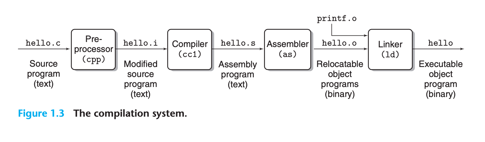
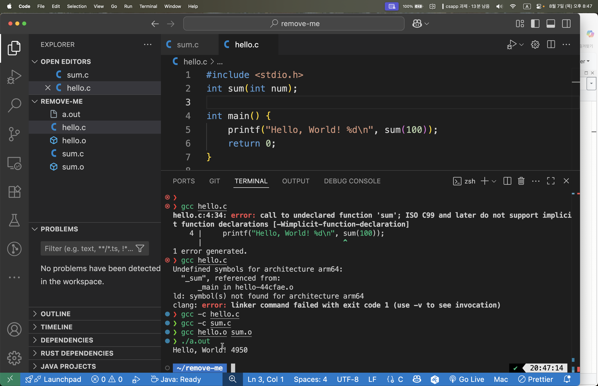

# 컴파일과 링커



```c
# -o 는 출력 파일 이름을 지정하는 옵션, 없으면 임의로 지정된 값이 나온다. 
# 컴파일 후 실행 파일 생성
$ gcc hello.c -o hello
$ ./hello
Hello, World!
```

```c
# -c 는 컴파일만 하고 실행 파일을 생성하지 않는다. 
# 컴파일 후 오브젝트 파일 생성
$ gcc hello.c -c hello
$ ls
hello.c hello.o
```

```c
# -S 는 컴파일만 하고 어셈블리 코드를 생성한다. 
# 컴파일 후 어셈블리 코드 파일 생성
$ gcc hello.c -S hello
$ ls
hello.c hello.s
```

## Link Time Error (링크 타임 에러)

Link time error는 컴파일은 성공했지만, 링킹 단계에서 발생하는 오류이다. 주로 함수나 변수의 정의를 찾을 수 없을 때 발생한다.

### 링크 타임 에러가 발생하는 경우

1. **함수 선언만 있고 정의가 없는 경우**
2. **외부 라이브러리를 링크하지 않은 경우**
3. **심볼 이름이 맞지 않는 경우**

### 실제 예제로 링크 타임 에러 확인하기

현재 0001 폴더에 있는 `hello.c`와 `sum.c`를 사용하여 링크 타임 에러를 확인해보자.

#### 1. hello.c만 컴파일하는 경우 (링크 에러 발생)

```bash
# hello.c만 컴파일하면 sum 함수의 정의를 찾을 수 없어서 링크 에러 발생
$ gcc hello.c -o hello
undefined symbols for architecture x86_64:
  "_sum", referenced from:
      _main in hello-xxxxxx.o
ld: symbol(s) not found for architecture x86_64
collect2: error: ld returned 1 exit status
```

**왜 에러가 발생할까?**
- `hello.c`에서 `sum` 함수를 선언(`int sum(int num);`)했지만
- 실제 구현은 `sum.c`에 있어서 링커가 `sum` 함수의 정의를 찾을 수 없음

#### 2. 개별 컴파일 후 링킹하는 방법

```bash
# 각각 오브젝트 파일로 컴파일 (문제없음)
$ gcc -c hello.c    # hello.o 생성
$ gcc -c sum.c      # sum.o 생성

# 오브젝트 파일들을 링크하여 실행파일 생성
$ gcc hello.o sum.o -o hello
$ ./hello
Hello, World! 4950
```

#### 3. 한 번에 컴파일하고 링킹하는 방법

```bash
# 모든 소스파일을 한번에 컴파일 및 링킹
$ gcc hello.c sum.c -o hello
$ ./hello
Hello, World! 4950
```

### 링크 타임 에러 vs 컴파일 타임 에러

| 구분 | 컴파일 타임 에러 | 링크 타임 에러 |
|------|------------------|----------------|
| **발생 시점** | 소스코드를 오브젝트 파일로 변환할 때 | 오브젝트 파일들을 실행파일로 결합할 때 |
| **주요 원인** | 문법 오류, 타입 불일치, 선언되지 않은 변수 등 | 정의되지 않은 함수/변수, 라이브러리 누락 등 |
| **에러 메시지** | `error: undeclared identifier` | `undefined reference to` 또는 `undefined symbols` |

### Forward Declaration의 역할

```c
int sum(int num); // forward declaration
```

- **컴파일 단계**: 컴파일러에게 "sum이라는 함수가 존재한다"고 알려줌
- **링킹 단계**: 링커가 실제 sum 함수의 구현을 찾아서 연결함
- **장점**: 함수의 정의 순서에 상관없이 사용 가능

## 실습 
```bash
# 1. 링크 에러 발생시키기
$ gcc hello.c -o hello

# 2. 올바른 링킹
$ gcc hello.c sum.c -o hello
$ ./hello

# 3. 개별 컴파일 후 링킹
$ gcc -c hello.c
$ gcc -c sum.c  
$ gcc hello.o sum.o -o hello
$ ./hello
```

