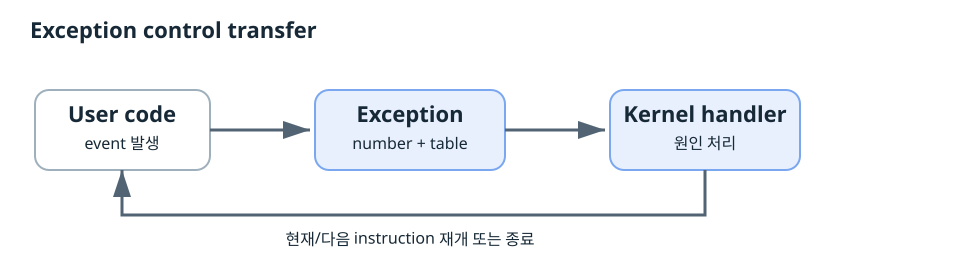
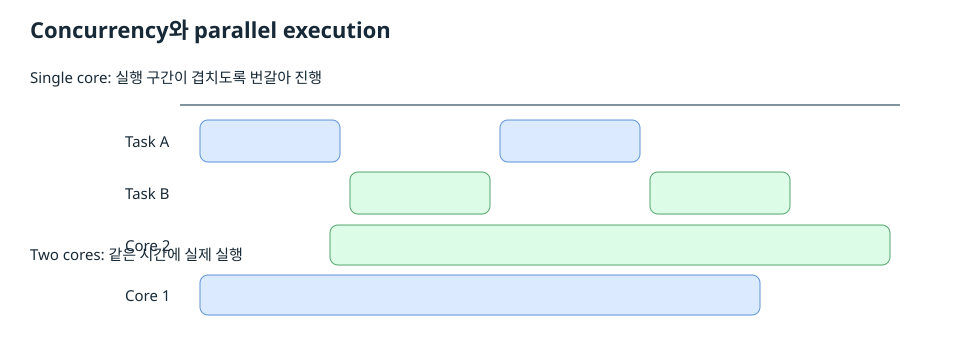
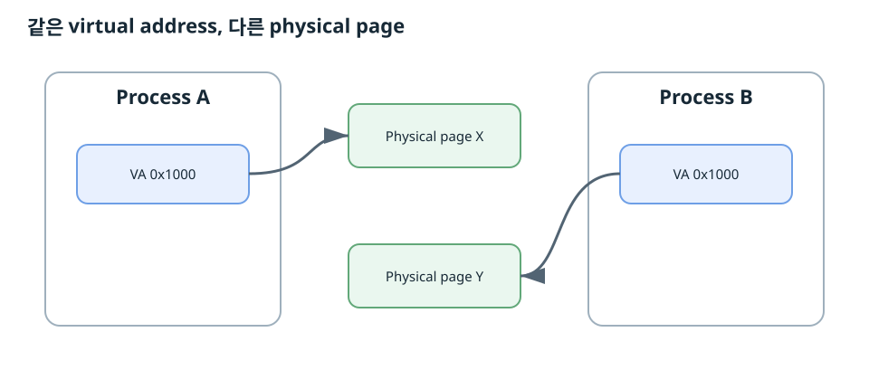
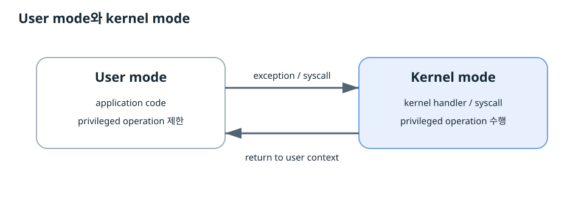

# 2026-10-04 CSAPP Ch8 Exceptional Control Flow

오늘 범위는 **8.1 Exceptions부터 8.2.4 User and Kernel Modes까지**다.

HTML 원본: [2026-10-04-csapp-ch8-exceptional-control-flow.html](2026-10-04-csapp-ch8-exceptional-control-flow.html)

## 한 장 지도



`event → exception → kernel handler → 실행 재개 또는 종료`

Process는 **logical control flow**와 **private virtual address space**를 제공한다.

## 8.1 Exceptions

Processor가 event를 감지하면 현재 control flow를 중단하고 exception handler로 control을 넘긴다. Exception number를 사용해 exception table에서 handler를 찾는다.

| 분류 | 원인 | handler 이후 |
|---|---|---|
| Interrupt | 외부 I/O event | 다음 instruction |
| Trap | 의도된 synchronous event | 다음 instruction |
| Fault | 복구 가능한 오류 가능성 | 복구 후 faulting instruction 재실행 가능 |
| Abort | 심각한 hardware/system 상태 | application flow로 정상 복귀하지 않음 |

### System call을 strace로 보기

```text
write(1, "hello, world\n", 13) = 13
exit_group(0)                  = ?
+++ exited with 0 +++
```

Linux x86-64 raw syscall ABI에서 syscall number는 `rax`, 첫 인자는 `rdi`에 들어간다. `write()`의 첫 인자는 file descriptor다. `0 = stdin`, `1 = stdout`, `2 = stderr`다.

## 8.2 Processes

### 8.2.1 Logical Control Flow

각 process는 자기 instruction이 연속해서 실행되는 것처럼 관찰한다. 실제 CPU에서는 여러 process의 실행 구간이 섞일 수 있다. Kernel scheduler가 실행할 context를 선택한다.

### 8.2.2 Concurrent Flows



CS:APP는 두 logical flow의 실행 interval이 시간상 겹치면 concurrent라고 정의한다. 서로 다른 processor/core에서 동시에 실행되는 concurrent flow를 parallel flow라고 설명한다.

수업에서는 서버 동시성까지 확장했다. 웹 서버는 request가 network 또는 database I/O를 기다리는 동안 다른 request를 진행할 수 있어야 한다. Connection마다 OS thread를 계속 늘리는 구조는 stack memory와 scheduling 비용을 키운다. C10K, event-driven I/O, async runtime, lightweight thread가 이 문제와 연결된다.

### Blocking call과 function coloring

Async runtime에서 blocking call은 worker thread를 점유한다. Non-blocking I/O는 대기 상태를 runtime에 등록하고 worker가 다른 task를 실행할 수 있게 한다.

Go runtime의 핵심 실행 단위는 G/M/P다.

| 이름 | 의미 |
|---|---|
| G | goroutine. logical task, stack, scheduling state |
| M | machine. OS thread |
| P | Go code 실행에 필요한 scheduler resource |

Network I/O는 runtime netpoller와 연결된다. Blocking syscall에 M이 대기해도 P를 다른 M에서 사용할 수 있어 runnable goroutine이 계속 진행할 수 있다.

## 8.2.3 Private Address Space



CS:APP의 process 문맥에서 **private address space는 process가 보는 virtual address space**다.

Process A의 virtual address `0x1000`과 Process B의 virtual address `0x1000`은 서로 다른 physical page를 가리킬 수 있다. MMU와 page table이 virtual address를 physical address로 변환한다.

Process address space에는 read-only code, read/write data, run-time heap, memory-mapped region, user stack, kernel virtual memory 영역이 나타난다.

### 주소 문제 조사

```bash
cat /proc/<pid>/maps
pmap <pid>
gdb ./program
(gdb) info proc mappings
(gdb) p &variable
```

1. PID를 확인한다.
2. virtual address를 확인한다.
3. `/proc/PID/maps`에서 mapping을 찾는다.
4. `r/w/x` permission을 확인한다.
5. file-backed mapping과 anonymous mapping을 구분한다.
6. process마다 mapping을 따로 확인한다.

## 8.2.4 User and Kernel Modes



CPU는 현재 실행 코드의 privilege level을 구분한다.

| 구분 | User mode | Kernel mode |
|---|---|---|
| 실행 코드 | application code | kernel code |
| privileged operation | 제한 | 수행 가능 |
| kernel 영역 접근 | 직접 접근 제한 | kernel 권한으로 접근 |

x86의 privileged operation 예:

```asm
mov %rax, %cr3
cli
sti
hlt
```

`CR3`는 page-table translation의 핵심 상태와 연결된다. Linux에서 system shutdown은 application의 요청, kernel 권한 검사, system 정리, platform power-management 단계로 이어진다.

## 오늘의 시스템 모델

1. Exception이 kernel 진입점을 제공한다.
2. Process가 logical control flow를 제공한다.
3. Private virtual address space가 process별 memory view를 분리한다.
4. CPU privilege가 kernel 자원을 보호한다.

## 디버깅 기준

`관찰 → 실행 계층 식별 → 상태 확인 → OS 경계 확인 → 가설 → 도구로 검증 → 수정`

- syscall/signal 흐름: `strace`
- virtual mapping: `/proc/PID/maps`, `pmap`
- register와 fault 위치: `gdb`, core dump
- 많은 connection의 blocking: `strace`, `/proc`, runtime profiler
